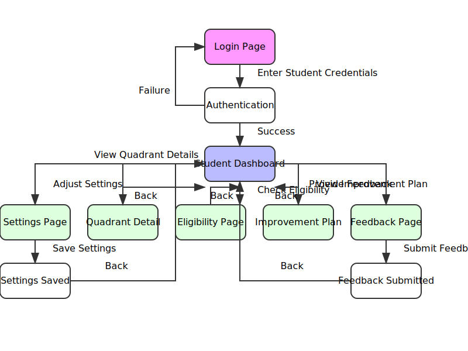
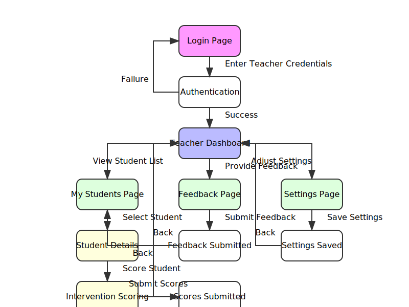
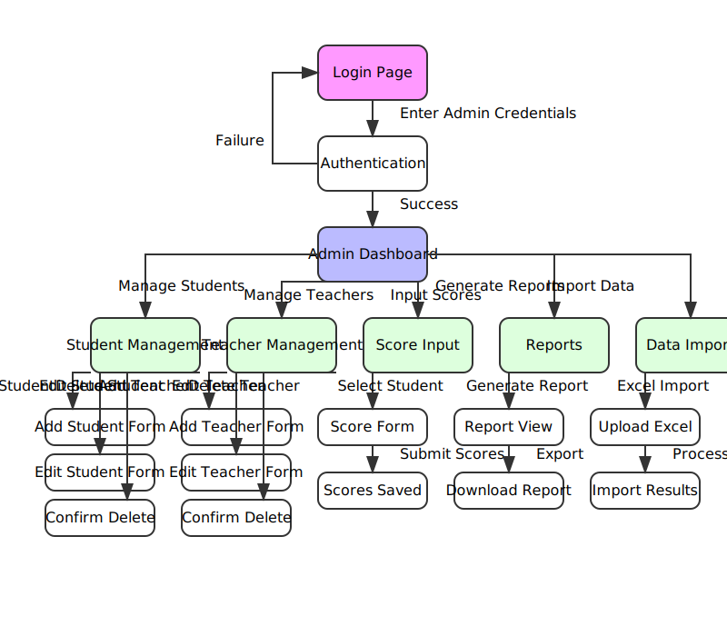

# PEP Score Nexus - Technical Architecture Documentation

## Table of Contents
1. [Introduction](#introduction)
2. [Frontend Architecture](#frontend-architecture)
   - [Technology Stack](#technology-stack)
   - [Component Structure](#component-structure)
   - [State Management](#state-management)
   - [Routing System](#routing-system)
   - [Styling Architecture](#styling-architecture)
3. [Data Architecture](#data-architecture)
   - [Data Models](#data-models)
   - [Data Flow](#data-flow)
   - [Mock Data Implementation](#mock-data-implementation)
4. [Authentication and Authorization](#authentication-and-authorization)
   - [Authentication Flow](#authentication-flow)
   - [Role-Based Access Control](#role-based-access-control)
   - [Security Considerations](#security-considerations)
5. [User Interface Design](#user-interface-design)
   - [Design System](#design-system)
   - [Responsive Design](#responsive-design)
   - [Accessibility](#accessibility)
6. [Performance Optimization](#performance-optimization)
7. [Build and Deployment](#build-and-deployment)
8. [User Flows](#user-flows)
   - [Student User Flow](#student-user-flow)
   - [Teacher User Flow](#teacher-user-flow)
   - [Admin User Flow](#admin-user-flow)
9. [Future Enhancements](#future-enhancements)

## Introduction

PEP Score Nexus is a web application designed to manage and track student performance in a Personality Enhancement Program (PEP). The system serves three distinct user roles (students, teachers, and administrators) and provides tailored interfaces for each role to interact with the performance data.

The application tracks student performance across four main assessment quadrants:
- **Persona** (50% weightage)
- **Wellness** (30% weightage)
- **Behavior** (10% weightage)
- **Discipline** (10% weightage)

This document provides a comprehensive overview of the technical architecture of the PEP Score Nexus application.

## Frontend Architecture

### Technology Stack

The PEP Score Nexus application is built using a modern frontend technology stack:

| Technology | Purpose | Version |
|------------|---------|---------|
| React | UI Library | 18.3.x |
| TypeScript | Type Safety | 5.5.x |
| Vite | Build Tool | 5.4.x |
| React Router | Routing | 6.x |
| shadcn-ui | UI Component Library | N/A |
| Radix UI | Accessible Primitives | Various |
| Tailwind CSS | Styling | 3.4.x |
| React Query | Data Fetching | 5.x |
| Recharts | Data Visualization | 2.x |

The application leverages the strengths of each technology:

- **React**: Provides a component-based architecture for building interactive UIs
- **TypeScript**: Ensures type safety and improves developer experience
- **Vite**: Offers fast development server and optimized production builds
- **React Router**: Enables declarative routing with code-splitting capabilities
- **shadcn-ui + Radix UI**: Provides accessible, customizable UI components
- **Tailwind CSS**: Enables rapid UI development with utility-first approach
- **React Query**: Manages server state with caching and synchronization
- **Recharts**: Creates responsive, customizable charts for data visualization

### Component Structure

The application follows a well-organized component structure that promotes reusability, maintainability, and separation of concerns:

```
/src
  /components
    /admin        # Admin-specific components
    /common       # Shared components
    /layout       # Layout components
    /student      # Student-specific components
    /teacher      # Teacher-specific components
    /ui           # UI component library
  /contexts       # React context providers
  /data           # Mock data and models
  /hooks          # Custom React hooks
  /lib            # Utility functions
  /pages          # Page components by role
    /admin        # Admin pages
    /student      # Student pages
    /teacher      # Teacher pages
```

#### Key Component Categories:

1. **UI Components** (`/src/components/ui/`)
   - Reusable, atomic UI components
   - Based on shadcn-ui and Radix UI primitives
   - Examples: Button, Card, Dialog, Form, Input, Select

2. **Layout Components** (`/src/components/layout/`)
   - `Layout.tsx`: Main layout wrapper
   - `AppSidebar.tsx`: Navigation sidebar with role-specific menus

3. **Feature Components** (by domain)
   - Domain-specific components organized by feature area
   - Examples:
     - `QuadrantCard.tsx`: Displays quadrant score information
     - `LeaderboardCard.tsx`: Shows student rankings
     - `StatusBadge.tsx`: Visual indicator for status types

4. **Page Components** (`/src/pages/`)
   - Compose smaller components to create complete views
   - Handle page-specific state and data fetching
   - Organized by user role for clear separation

This structure enables:
- Clear separation of concerns
- Component reusability across the application
- Easier maintenance and testing
- Role-specific component organization

### State Management

The application employs a hybrid state management approach:

#### 1. React Context API

Used for global application state that needs to be accessed by multiple components:

```typescript
// AuthContext.tsx
import React, { createContext, useContext, useState, ReactNode } from "react";

type UserRole = "student" | "admin" | "teacher" | null;

interface AuthContextType {
  isAuthenticated: boolean;
  userRole: UserRole;
  userId: string | null;
  login: (username: string, password: string) => Promise<boolean>;
  logout: () => void;
}

const AuthContext = createContext<AuthContextType | undefined>(undefined);

export const useAuth = () => {
  const context = useContext(AuthContext);
  if (!context) {
    throw new Error("useAuth must be used within an AuthProvider");
  }
  return context;
};

export const AuthProvider: React.FC<AuthProviderProps> = ({ children }) => {
  // Implementation details...
};
```

Key contexts:
- **AuthContext**: Manages authentication state and user roles
- **SidebarContext**: Controls sidebar state (expanded/collapsed)

#### 2. Local Component State

Used for UI state that is specific to a component:

```typescript
// Example from StudentDashboard.tsx
const [selectedTermId, setSelectedTermId] = useState(studentData.currentTerm);
const [activeTab, setActiveTab] = useState("quadrants");
```

#### 3. React Query

Set up for data fetching, caching, and server state management:

```typescript
// From App.tsx
const queryClient = new QueryClient();

const App = () => (
  <QueryClientProvider client={queryClient}>
    <AuthProvider>
      {/* Application components */}
    </AuthProvider>
  </QueryClientProvider>
);
```

This approach:
- Keeps global state minimal and focused
- Localizes state to where it's needed
- Separates UI state from server state
- Provides optimized data fetching and caching

### Routing System

The application uses React Router v6 for navigation and routing:

#### Route Configuration

Routes are defined in `App.tsx` using the declarative Routes/Route components:

```typescript
// Simplified example from App.tsx
const AppRoutes = () => {
  return (
    <Routes>
      <Route path="/" element={<Login />} />

      {/* Student Routes */}
      <Route path="/student" element={
        <ProtectedRoute requiredRole="student">
          <Layout>
            <StudentDashboard />
          </Layout>
        </ProtectedRoute>
      } />
      <Route path="/student/quadrant/:quadrantId" element={
        <ProtectedRoute requiredRole="student">
          <Layout>
            <QuadrantDetail />
          </Layout>
        </ProtectedRoute>
      } />

      {/* Teacher Routes */}
      <Route path="/teacher" element={
        <ProtectedRoute requiredRole="teacher">
          <Layout>
            <TeacherDashboard />
          </Layout>
        </ProtectedRoute>
      } />

      {/* Admin Routes */}
      <Route path="/admin" element={
        <ProtectedRoute requiredRole="admin">
          <Layout>
            <AdminDashboard />
          </Layout>
        </ProtectedRoute>
      } />

      {/* Catch-all route */}
      <Route path="*" element={<NotFound />} />
    </Routes>
  );
};
```

#### Protected Routes

A custom `ProtectedRoute` component enforces authentication and role-based access:

```typescript
// From App.tsx
const ProtectedRoute = ({
  children,
  requiredRole
}: {
  children: React.ReactNode;
  requiredRole: "student" | "admin" | "teacher";
}) => {
  const { isAuthenticated, userRole } = useAuth();

  if (!isAuthenticated) {
    return <Navigate to="/" replace />;
  }

  if (requiredRole && userRole !== requiredRole) {
    return <Navigate to="/" replace />;
  }

  return <>{children}</>;
};
```

#### Navigation

Navigation is handled through:
- The sidebar navigation menu
- Programmatic navigation using the `useNavigate` hook
- Automatic redirects based on authentication status

This routing system:
- Enforces role-based access control
- Provides a consistent layout across pages
- Enables code-splitting for better performance
- Handles URL parameters for dynamic content

### Styling Architecture

The application uses a modern approach to styling:

#### 1. Tailwind CSS

Utility-first CSS framework configured in `tailwind.config.ts`:

```typescript
// tailwind.config.ts
export default {
  darkMode: ["class"],
  content: [
    "./pages/**/*.{ts,tsx}",
    "./components/**/*.{ts,tsx}",
    "./app/**/*.{ts,tsx}",
    "./src/**/*.{ts,tsx}",
  ],
  theme: {
    extend: {
      fontFamily: {
        inter: ['Inter', 'sans-serif'],
      },
      colors: {
        // Custom color palette
      }
    }
  },
  plugins: [
    require("tailwindcss-animate"),
    require("@tailwindcss/typography")
  ],
}
```

#### 2. Class Variance Authority (CVA)

Used for creating variant-based component styling:

```typescript
// Example from button.tsx
const buttonVariants = cva(
  "inline-flex items-center justify-center whitespace-nowrap rounded-md text-sm font-medium transition-colors focus-visible:outline-none focus-visible:ring-1 focus-visible:ring-ring disabled:pointer-events-none disabled:opacity-50",
  {
    variants: {
      variant: {
        default: "bg-primary text-primary-foreground shadow hover:bg-primary/90",
        destructive: "bg-destructive text-destructive-foreground shadow-sm hover:bg-destructive/90",
        outline: "border border-input bg-background shadow-sm hover:bg-accent hover:text-accent-foreground",
        // Other variants...
      },
      size: {
        default: "h-9 px-4 py-2",
        sm: "h-8 rounded-md px-3 text-xs",
        lg: "h-10 rounded-md px-8",
        icon: "h-9 w-9",
      },
    },
    defaultVariants: {
      variant: "default",
      size: "default",
    },
  }
)
```

#### 3. Tailwind Merge

Utility for merging Tailwind CSS classes:

```typescript
// lib/utils.ts
import { type ClassValue, clsx } from "clsx"
import { twMerge } from "tailwind-merge"

export function cn(...inputs: ClassValue[]) {
  return twMerge(clsx(inputs))
}
```

This styling approach:
- Provides consistent design across the application
- Enables rapid UI development
- Reduces CSS bundle size
- Allows for theme customization
- Supports responsive design

## Data Architecture

### Data Models

The application uses TypeScript interfaces to define its data models, ensuring type safety and consistency throughout the codebase:

#### Core Data Models

```typescript
// From src/data/mockData.ts

// Grade types based on Excel file
export type Grade = 'A+' | 'A' | 'B' | 'C' | 'D' | 'E' | 'IC';

// Status types for components and quadrants
export type StatusType = 'Good' | 'Progress' | 'Deteriorate' | 'Cleared' | 'Not Cleared' | 'Attendance Shortage';

export interface Component {
  id: string;
  name: string;
  score: number;
  maxScore: number;
  status?: StatusType;
  category?: 'SHL' | 'Professional'; // For Persona components categorization
}

export interface QuadrantData {
  id: string;
  name: string;
  weightage: number;
  obtained: number;
  components: Component[];
  status: StatusType;
  attendance?: number; // Attendance percentage
  eligibility?: 'Eligible' | 'Not Eligible'; // Eligibility status
  rank?: number; // Rank within the batch for this quadrant
}

export interface TermData {
  termId: string; // e.g., "Term1", "Term2"
  termName: string; // e.g., "Term 1 / Level 0"
  quadrants: QuadrantData[];
  tests: TestScore[];
  totalScore: number;
  grade: Grade;
  overallStatus: StatusType;
}

export interface Student {
  id: string;
  name: string;
  registrationNo: string;
  course: string;
  batch: string;
  section: string;
  houseName?: string;
  gender: 'Male' | 'Female' | 'Other';
  currentTerm: string; // Reference to the current term ID
  terms: TermData[]; // All terms data
  totalScore: number; // Current term score
  grade: Grade; // Current term grade
  overallStatus: StatusType; // Current term status
  quadrants: QuadrantData[]; // Current term quadrants (for backward compatibility)
  tests: TestScore[]; // Current term tests (for backward compatibility)
}

export interface Leaderboard {
  overall: {
    topStudents: { id: string; name: string; score: number }[];
    userRank: number;
    batchAvg: number;
    batchBest: number;
  };
  quadrants: Record<string, {
    topStudents: { id: string; name: string; score: number }[];
    userRank: number;
    batchAvg: number;
    batchBest: number;
  }>;
}
```

#### Key Data Structures:

1. **Student**: The central entity representing a student with personal and academic information
2. **TermData**: Term-specific performance data for a student
3. **QuadrantData**: Performance data for each assessment quadrant (Persona, Wellness, Behavior, Discipline)
4. **Component**: Individual assessment components within quadrants
5. **Leaderboard**: Ranking data for students across different quadrants

These data models:
- Provide a clear structure for the application's data
- Enable TypeScript's type checking for data consistency
- Support nested relationships between entities
- Include enumerations for constrained values (Grade, StatusType)

### Data Flow

The application's data flow is designed to support the different user roles and their interactions with the system:

#### Current Implementation (Mock Data)

```
┌─────────────────┐     ┌─────────────────┐     ┌─────────────────┐
│                 │     │                 │     │                 │
│  Component UI   │◄────┤   Mock Data     │────►│  Local State    │
│                 │     │                 │     │                 │
└─────────────────┘     └─────────────────┘     └─────────────────┘
```

1. **Data Source**: Currently uses mock data defined in `/src/data/mockData.ts`
2. **Data Consumption**: Components import and use the mock data directly
3. **State Management**: Some data is copied to local state for UI interactions
4. **Updates**: Changes are currently only reflected in local state, not persisted

#### Future Implementation (API Integration)

```
┌─────────────────┐     ┌─────────────────┐     ┌─────────────────┐
│                 │     │                 │     │                 │
│  Component UI   │◄────┤  React Query    │◄────┤   API Service   │
│                 │     │    Cache        │     │                 │
└─────────────────┘     └─────────────────┘     └─────────────────┘
                                                        ▲
                                                        │
                                                        ▼
                                               ┌─────────────────┐
                                               │                 │
                                               │   Backend API   │
                                               │                 │
                                               └─────────────────┘
```

1. **Data Source**: Backend API endpoints
2. **Data Fetching**: API service layer to handle requests
3. **State Management**: React Query for caching and synchronization
4. **Updates**: Mutations through React Query with optimistic updates

### Mock Data Implementation

The application currently uses mock data to simulate backend functionality:

```typescript
// Excerpt from mockData.ts
export const studentData: Student = {
  id: "2024-Ajith",
  name: "Ajith",
  registrationNo: "2334",
  course: "PGDM",
  batch: "2024",
  section: "A",
  houseName: "Daredevils",
  gender: "Male",
  currentTerm: "Term1",
  totalScore: 95,
  grade: "A+",
  overallStatus: "Good",
  terms: [
    {
      termId: "Term1",
      termName: "Term 1 / Level 0",
      totalScore: 95,
      grade: "A+",
      overallStatus: "Good",
      quadrants: [
        // Quadrant data...
      ],
      tests: [
        // Test data...
      ]
    }
  ]
};

// Mock leaderboard data
export const leaderboardData: Leaderboard = {
  overall: {
    topStudents: [
      { id: "2024-Student1", name: "Rohan S", score: 97 },
      { id: "2024-Student2", name: "Priya M", score: 96 },
      { id: "2024-Ajith", name: "Ajith", score: 95 }
    ],
    userRank: 3,
    batchAvg: 82,
    batchBest: 97
  },
  quadrants: {
    // Quadrant-specific leaderboard data...
  }
};
```

This mock data implementation:
- Simulates the expected API responses
- Provides realistic data for development and testing
- Follows the same structure that would be expected from a backend API
- Enables development of the UI without a backend dependency

## Authentication and Authorization

### Authentication Flow

The application implements a simple authentication flow using React Context:

```
┌─────────────┐     ┌─────────────────┐     ┌─────────────────┐
│             │     │                 │     │                 │
│  Login Form │────►│  AuthContext    │────►│  Protected      │
│             │     │  Provider       │     │  Routes         │
└─────────────┘     └─────────────────┘     └─────────────────┘
```

#### Implementation Details:

```typescript
// From AuthContext.tsx
const MOCK_CREDENTIALS = {
  student: { username: "student", password: "password", userId: "2024-Ajith" },
  admin: { username: "admin", password: "password", userId: "admin-001" },
  teacher: { username: "teacher", password: "password", userId: "teacher-001" }
};

export const AuthProvider: React.FC<AuthProviderProps> = ({ children }) => {
  const [isAuthenticated, setIsAuthenticated] = useState(false);
  const [userRole, setUserRole] = useState<UserRole>(null);
  const [userId, setUserId] = useState<string | null>(null);

  const login = async (username: string, password: string): Promise<boolean> => {
    // Mock authentication logic
    if (username === MOCK_CREDENTIALS.student.username && password === MOCK_CREDENTIALS.student.password) {
      setIsAuthenticated(true);
      setUserRole("student");
      setUserId(MOCK_CREDENTIALS.student.userId);
      return true;
    } else if (username === MOCK_CREDENTIALS.admin.username && password === MOCK_CREDENTIALS.admin.password) {
      setIsAuthenticated(true);
      setUserRole("admin");
      setUserId(MOCK_CREDENTIALS.admin.userId);
      return true;
    } else if (username === MOCK_CREDENTIALS.teacher.username && password === MOCK_CREDENTIALS.teacher.password) {
      setIsAuthenticated(true);
      setUserRole("teacher");
      setUserId(MOCK_CREDENTIALS.teacher.userId);
      return true;
    } else {
      return false;
    }
  };

  const logout = () => {
    setIsAuthenticated(false);
    setUserRole(null);
    setUserId(null);
  };

  return (
    <AuthContext.Provider value={{ isAuthenticated, userRole, userId, login, logout }}>
      {children}
    </AuthContext.Provider>
  );
};
```

#### Login Component:

```typescript
// From Login.tsx (simplified)
const Login: React.FC = () => {
  const [username, setUsername] = useState("");
  const [password, setPassword] = useState("");
  const { login } = useAuth();
  const navigate = useNavigate();

  const handleSubmit = async (e: React.FormEvent) => {
    e.preventDefault();
    const success = await login(username, password);
    if (success) {
      if (username === "admin") {
        navigate("/admin");
      } else if (username === "teacher") {
        navigate("/teacher");
      } else {
        navigate("/student");
      }
    }
  };

  // Render login form...
};
```

This authentication flow:
- Provides a simple login mechanism with mock credentials
- Stores authentication state in React Context
- Sets the user role based on login credentials
- Redirects users to role-appropriate dashboards
- Enables logout functionality

### Role-Based Access Control

The application implements role-based access control (RBAC) to restrict access to specific routes and features:

#### Protected Routes:

```typescript
// From App.tsx
const ProtectedRoute = ({
  children,
  requiredRole
}: {
  children: React.ReactNode;
  requiredRole: "student" | "admin" | "teacher";
}) => {
  const { isAuthenticated, userRole } = useAuth();

  if (!isAuthenticated) {
    return <Navigate to="/" replace />;
  }

  if (requiredRole && userRole !== requiredRole) {
    return <Navigate to="/" replace />;
  }

  return <>{children}</>;
};
```

#### Role-Specific Navigation:

```typescript
// From AppSidebar.tsx
export function AppSidebar() {
  const { userRole, logout } = useAuth();

  const studentMenuItems = [
    { title: "Dashboard", path: "/student", icon: Home },
    { title: "Feedback", path: "/student/feedback", icon: MessageSquare },
    { title: "Settings", path: "/student/settings", icon: Settings },
  ];

  const teacherMenuItems = [
    { title: "Dashboard", path: "/teacher", icon: Home },
    { title: "My Students", path: "/teacher/students", icon: GraduationCap },
    // More teacher menu items...
  ];

  const adminMenuItems = [
    { title: "Dashboard", path: "/admin", icon: Home },
    { title: "Manage Students", path: "/admin/students", icon: Users },
    // More admin menu items...
  ];

  let menuItems;
  if (userRole === "admin") {
    menuItems = adminMenuItems;
  } else if (userRole === "teacher") {
    menuItems = teacherMenuItems;
  } else {
    menuItems = studentMenuItems;
  }

  // Render sidebar with appropriate menu items...
}
```

This RBAC implementation:
- Restricts access to routes based on user role
- Provides role-specific navigation menus
- Prevents unauthorized access to protected resources
- Creates a tailored user experience for each role

### Security Considerations

The current implementation is focused on frontend functionality with mock authentication. In a production environment, several security enhancements would be necessary:

1. **Token-Based Authentication**
   - Implement JWT or similar token-based authentication
   - Store tokens securely (HTTP-only cookies)
   - Include token expiration and refresh mechanisms

2. **Server-Side Validation**
   - Validate all requests on the server side
   - Implement proper authorization checks for API endpoints
   - Prevent unauthorized data access

3. **HTTPS**
   - Ensure all communication is encrypted with HTTPS
   - Implement proper SSL/TLS configuration

4. **CSRF Protection**
   - Implement Cross-Site Request Forgery protection
   - Use anti-CSRF tokens for sensitive operations

5. **Input Validation**
   - Validate all user inputs on both client and server
   - Sanitize data to prevent XSS attacks

6. **Rate Limiting**
   - Implement rate limiting for authentication attempts
   - Prevent brute force attacks

These security considerations would be critical for a production deployment of the application.

## User Interface Design

### Design System

The application implements a consistent design system based on shadcn-ui components and Tailwind CSS:

#### Component Library

The UI is built using shadcn-ui, which provides a collection of accessible, customizable components:

```typescript
// Example Button component from shadcn-ui
import * as React from "react"
import { Slot } from "@radix-ui/react-slot"
import { cva, type VariantProps } from "class-variance-authority"

import { cn } from "@/lib/utils"

const buttonVariants = cva(
  "inline-flex items-center justify-center whitespace-nowrap rounded-md text-sm font-medium transition-colors focus-visible:outline-none focus-visible:ring-1 focus-visible:ring-ring disabled:pointer-events-none disabled:opacity-50",
  {
    variants: {
      variant: {
        default: "bg-primary text-primary-foreground shadow hover:bg-primary/90",
        destructive: "bg-destructive text-destructive-foreground shadow-sm hover:bg-destructive/90",
        outline: "border border-input bg-background shadow-sm hover:bg-accent hover:text-accent-foreground",
        secondary: "bg-secondary text-secondary-foreground shadow-sm hover:bg-secondary/80",
        ghost: "hover:bg-accent hover:text-accent-foreground",
        link: "text-primary underline-offset-4 hover:underline",
      },
      size: {
        default: "h-9 px-4 py-2",
        sm: "h-8 rounded-md px-3 text-xs",
        lg: "h-10 rounded-md px-8",
        icon: "h-9 w-9",
      },
    },
    defaultVariants: {
      variant: "default",
      size: "default",
    },
  }
)
```

#### Design Tokens

The application uses a consistent set of design tokens defined in Tailwind CSS:

- **Colors**: Primary, secondary, accent, background, foreground, etc.
- **Typography**: Font families, sizes, weights, line heights
- **Spacing**: Consistent spacing scale
- **Shadows**: Elevation levels
- **Borders**: Border radius, width, color
- **Transitions**: Duration, timing functions

#### UI Patterns

The application implements consistent UI patterns across different views:

1. **Card-Based Layout**: Information is presented in card components
2. **Data Visualization**: Charts and graphs for performance data
3. **Form Controls**: Consistent input, select, and button styles
4. **Navigation**: Sidebar navigation with role-specific menus
5. **Status Indicators**: Visual indicators for performance status

### Responsive Design

The application is designed to work across different screen sizes:

#### Mobile-First Approach

```typescript
// Example of responsive design with Tailwind CSS
<div className="grid grid-cols-1 md:grid-cols-2 lg:grid-cols-4 gap-6">
  {/* Content */}
</div>
```

#### Responsive Sidebar

The sidebar adapts to different screen sizes:
- Collapsible on desktop (icon-only or hidden)
- Off-canvas menu on mobile with a toggle button

```typescript
// From Layout.tsx
return (
  <SidebarProvider>
    <div className="min-h-screen flex w-full">
      <AppSidebar />
      <main className="flex-1 p-2 md:p-6 overflow-y-auto">
        <div className="mb-2">
          <SidebarTrigger className="md:hidden" />
        </div>
        {children}
      </main>
    </div>
  </SidebarProvider>
);
```

#### Responsive Tables

Tables adapt to smaller screens by:
- Horizontal scrolling on small screens
- Stacking columns on very small screens
- Prioritizing important information

### Accessibility

The application implements accessibility features through Radix UI primitives:

#### Keyboard Navigation

- All interactive elements are keyboard accessible
- Focus management for modals and dialogs
- Skip links for keyboard users

#### Screen Reader Support

- Semantic HTML structure
- ARIA attributes for complex components
- Descriptive labels for form controls

#### Color Contrast

- Sufficient color contrast for text and UI elements
- Visual indicators beyond color (icons, text)
- Support for high contrast mode

## Performance Optimization

### Code Splitting

The application uses React Router for automatic code splitting by route:

```typescript
// Each route loads its components on demand
<Route path="/student" element={
  <ProtectedRoute requiredRole="student">
    <Layout>
      <StudentDashboard />
    </Layout>
  </ProtectedRoute>
} />
```

### Rendering Optimization

The application implements several techniques to optimize rendering:

1. **Component Memoization**: Using React.memo for expensive components
2. **Dependency Arrays**: Careful management of useEffect dependencies
3. **State Localization**: Keeping state as close as possible to where it's needed

### Asset Optimization

Vite handles asset optimization for production builds:

1. **Code Minification**: JavaScript and CSS minification
2. **Tree Shaking**: Removing unused code
3. **Asset Compression**: Optimizing images and other assets

### Performance Monitoring

The application could implement performance monitoring:

1. **React DevTools**: For component profiling
2. **Lighthouse**: For overall performance metrics
3. **Web Vitals**: For core web vitals monitoring

## Build and Deployment

### Development Environment

The application uses Vite for development:

```json
// package.json scripts
{
  "scripts": {
    "dev": "vite",
    "build": "vite build",
    "build:dev": "vite build --mode development",
    "lint": "eslint .",
    "preview": "vite preview"
  }
}
```

#### Development Features:

- Hot Module Replacement (HMR)
- Fast refresh for React components
- ESLint integration for code quality
- TypeScript type checking

### Build Process

The build process is configured in `vite.config.ts`:

```typescript
// vite.config.ts
import { defineConfig } from "vite";
import react from "@vitejs/plugin-react-swc";
import path from "path";
import { componentTagger } from "lovable-tagger";

export default defineConfig(({ mode }) => ({
  server: {
    host: "::",
    port: 8080,
  },
  plugins: [
    react(),
    mode === 'development' &&
    componentTagger(),
  ].filter(Boolean),
  resolve: {
    alias: {
      "@": path.resolve(__dirname, "./src"),
    },
  },
}));
```

#### Build Outputs:

- Optimized JavaScript bundles
- Minified CSS
- Static assets with hashed filenames
- HTML entry point

### Deployment Options

The application can be deployed through various methods:

1. **Static Hosting**:
   - Netlify, Vercel, GitHub Pages
   - AWS S3 + CloudFront
   - Google Cloud Storage + Cloud CDN

2. **Container-Based**:
   - Docker container
   - Kubernetes deployment
   - Cloud Run or AWS Fargate

3. **Server-Rendered**:
   - Node.js server with SSR
   - Serverless functions for API endpoints

## User Flows

The application supports three distinct user roles, each with its own user flow and experience.

### Student User Flow

The student user flow focuses on viewing performance data and accessing improvement resources:



#### Key Student Interactions:

1. **Authentication**: Students log in with their credentials
2. **Dashboard**: View overall performance across quadrants
3. **Quadrant Details**: Explore detailed performance in specific quadrants
4. **Eligibility**: Check eligibility status based on attendance and scores
5. **Improvement Plan**: Access personalized improvement suggestions
6. **Feedback**: Provide feedback to instructors
7. **Settings**: Adjust account settings and preferences

### Teacher User Flow

The teacher user flow focuses on student assessment and feedback:



#### Key Teacher Interactions:

1. **Authentication**: Teachers log in with their credentials
2. **Dashboard**: View overview of pending assessments and student performance
3. **Student Management**: View and manage assigned students
4. **Intervention Scoring**: Score student performance in specific quadrants
5. **Feedback**: Provide feedback to students and administrators
6. **Settings**: Adjust account settings and preferences

### Admin User Flow

The admin user flow focuses on system management and data administration:



#### Key Admin Interactions:

1. **Authentication**: Admins log in with their credentials
2. **Dashboard**: View system overview and key metrics
3. **Student Management**: Add, edit, and manage student records
4. **Teacher Management**: Add, edit, and manage teacher accounts
5. **Score Input**: Input and update student scores
6. **Reports**: Generate and export performance reports
7. **Data Import**: Import data from Excel or other sources

## Future Enhancements

The PEP Score Nexus application has several potential areas for future enhancement:

### Backend Integration

1. **API Development**
   - Develop RESTful API endpoints for all data operations
   - Implement proper authentication and authorization
   - Create data validation and sanitization middleware

2. **Database Implementation**
   - Design and implement a relational database schema
   - Set up database migrations and seeding
   - Implement efficient queries and indexing

3. **Real-time Updates**
   - Implement WebSocket connections for real-time notifications
   - Add real-time dashboard updates
   - Enable collaborative features

### Feature Enhancements

1. **Advanced Analytics**
   - Predictive analytics for student performance
   - Trend analysis across terms and batches
   - Comparative analysis between different student groups

2. **Notification System**
   - Email notifications for important events
   - In-app notification center
   - Scheduled reminders for pending assessments

3. **Mobile Application**
   - Develop native mobile applications for iOS and Android
   - Implement offline capabilities
   - Add push notifications

### Technical Improvements

1. **Performance Optimization**
   - Implement server-side rendering for initial page load
   - Add service workers for offline capabilities
   - Optimize bundle size and loading performance

2. **Testing Infrastructure**
   - Comprehensive unit test coverage
   - Integration tests for critical user flows
   - End-to-end testing for key features

3. **DevOps Integration**
   - Set up CI/CD pipeline
   - Implement automated testing in the deployment process
   - Configure monitoring and alerting

### Security Enhancements

1. **Advanced Authentication**
   - Multi-factor authentication
   - Single sign-on integration
   - Password policies and account recovery

2. **Data Protection**
   - End-to-end encryption for sensitive data
   - Data anonymization for reporting
   - Compliance with data protection regulations

3. **Audit Logging**
   - Comprehensive audit trails for all data changes
   - User activity monitoring
   - Security incident detection and response
