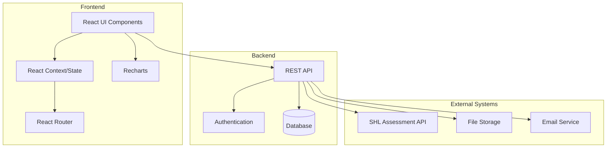
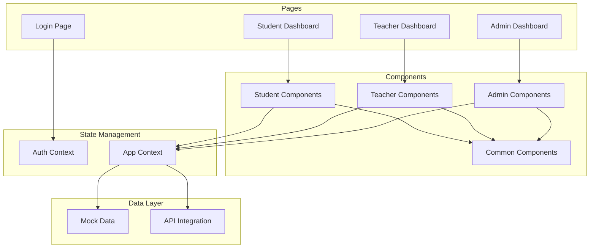
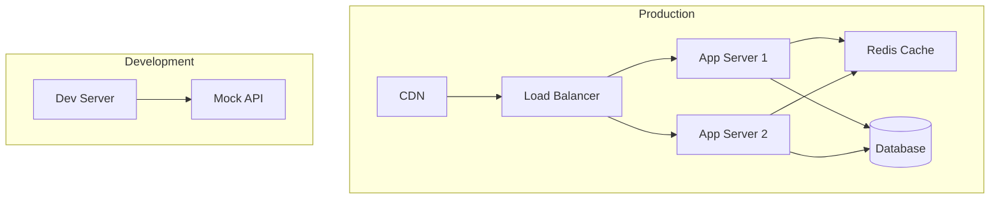
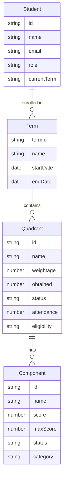
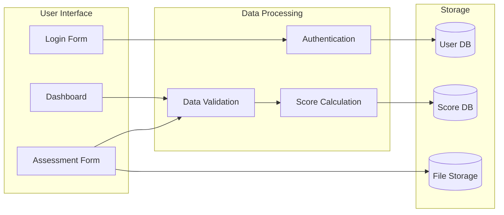
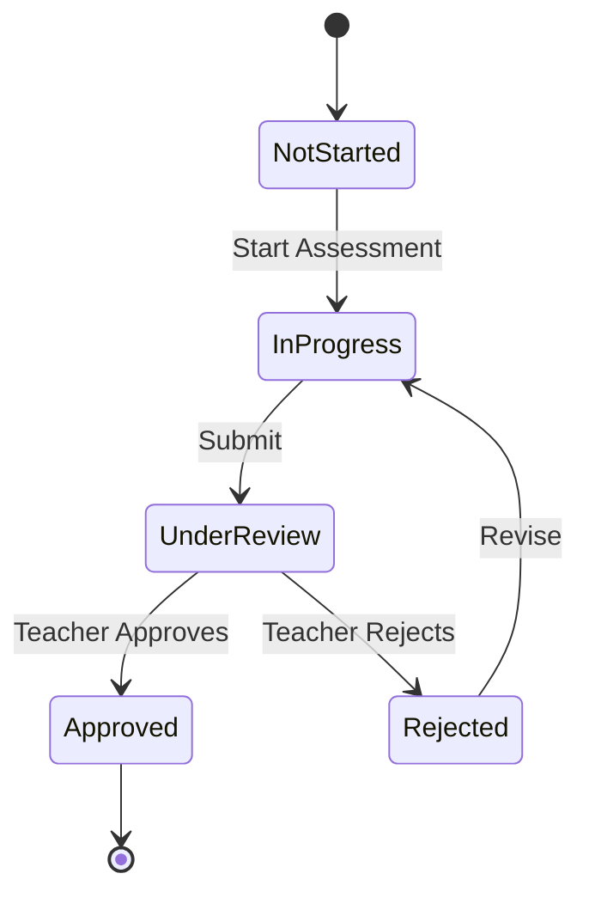
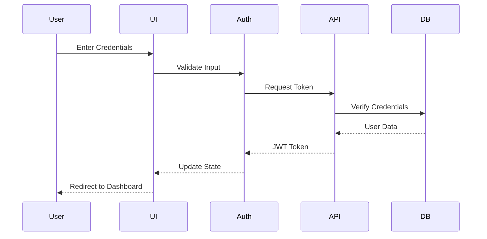

# Software Requirements Specification (SRS)
## PEP Score Nexus

### Table of Contents
1. [Introduction](#1-introduction)
2. [Overall Description](#2-overall-description)
3. [Specific Requirements](#3-specific-requirements)
4. [Supporting Information](#4-supporting-information)

### 1. Introduction

#### 1.1 Purpose
The PEP Score Nexus is a web application designed to manage and track student performance in a Personality Enhancement Program (PEP). It provides a comprehensive platform for students, teachers, and administrators to monitor, assess, and improve student performance across multiple assessment quadrants.

#### 1.2 Scope
The system covers the complete lifecycle of student performance tracking, including:
- Performance assessment across four main quadrants
- Progress tracking and visualization
- Intervention management
- Reporting and analytics
- Role-based access control
- Term-wise performance tracking
- Batch-wide performance comparison
- Improvement recommendations
- Attendance monitoring

#### 1.3 Definitions, Acronyms, Abbreviations
- PEP: Personality Enhancement Program
- SHL: Standardized assessment tool for competencies
- IC: Incomplete status
- Quadrant: Major assessment category in the program
- Term: Academic period for assessment
- Batch: Group of students in the same program cohort

#### 1.4 References
1. IEEE 830-1998 - IEEE Recommended Practice for Software Requirements Specifications
2. React Documentation - https://react.dev/
3. TypeScript Documentation - https://www.typescriptlang.org/
4. Tailwind CSS Documentation - https://tailwindcss.com/
5. Recharts Documentation - https://recharts.org/
6. JWT Authentication Best Practices - https://jwt.io/introduction
7. REST API Design Guidelines - https://restfulapi.net/

#### 1.5 Overview
The PEP Score Nexus is a web-based application built using modern frontend technologies:
- React with TypeScript
- Vite as the build tool
- shadcn-ui for UI components
- Tailwind CSS for styling
- React Query for data management
- Recharts for data visualization
- React Router for navigation
- Lucide icons for UI elements

### 2. Overall Description

#### 2.1 Product Perspective
The PEP Score Nexus is a web-based application built using modern frontend technologies:
- React with TypeScript
- Vite as the build tool
- shadcn-ui for UI components
- Tailwind CSS for styling
- React Query for data management
- Recharts for data visualization
- React Router for navigation
- Lucide icons for UI elements

#### 2.2 Product Functions
The system covers the complete lifecycle of student performance tracking, including:
- Performance assessment across four main quadrants
- Progress tracking and visualization
- Intervention management
- Reporting and analytics
- Role-based access control
- Term-wise performance tracking
- Batch-wide performance comparison
- Improvement recommendations
- Attendance monitoring

#### 2.3 User Classes and Characteristics

1. **Students**
   - Primary users who need to track their performance
   - Access to personal dashboard and improvement plans
   - View performance across all quadrants
   - Compare performance with batch averages
   - Track attendance and eligibility
   - Receive personalized improvement recommendations

2. **Teachers**
   - Assess student performance
   - Provide feedback and interventions
   - Track class-wide progress
   - Input scores for components
   - Manage student interventions
   - View student analytics

3. **Administrators**
   - Oversee program effectiveness
   - Generate reports and analytics
   - Manage system-wide settings
   - Monitor batch performance
   - Track attendance trends
   - Export performance data

#### 2.4 Operating Environment
1. **Browser Requirements**
   - Chrome 90+
   - Firefox 88+
   - Safari 14+
   - Edge 90+
   - Mobile browsers: Chrome for Android, Safari for iOS

2. **Device Requirements**
   - Desktop: Any modern computer with 4GB+ RAM
   - Mobile: Any smartphone with 2GB+ RAM
   - Tablet: Any modern tablet with 2GB+ RAM

3. **Network Requirements**
   - Minimum bandwidth: 1Mbps
   - Recommended bandwidth: 5Mbps+
   - Stable internet connection
   - Support for HTTPS

4. **Server Requirements**
   - Node.js 16+
   - 4GB+ RAM
   - 2+ CPU cores
   - 50GB+ storage
   - Linux/Unix-based OS

#### 2.5 Design and Implementation Constraints
1. **Technology Stack**
   - Frontend: React, TypeScript, Tailwind CSS
   - State Management: React Context
   - Charts: Recharts
   - Authentication: JWT
   - API: REST

2. **Development Standards**
   - ESLint for code linting
   - Prettier for code formatting
   - TypeScript strict mode
   - Component-based architecture
   - Responsive design principles

3. **Coding Guidelines**
   - Follow React best practices
   - Use TypeScript for type safety
   - Implement proper error handling
   - Write unit tests for critical components
   - Document code with JSDoc

4. **Performance Constraints**
   - Page load time < 3 seconds
   - API response time < 1 second
   - Memory usage < 100MB
   - Bundle size < 2MB
   - Support for 1000+ concurrent users

#### 2.6 User Documentation
1. **User Manual**
   - Installation guide
   - Getting started guide
   - Feature documentation
   - Troubleshooting guide
   - FAQ section

2. **Admin Guide**
   - System setup guide
   - Configuration guide
   - Maintenance procedures
   - Security guidelines
   - Backup and recovery procedures

3. **API Documentation**
   - Endpoint specifications
   - Authentication details
   - Request/response formats
   - Error codes
   - Rate limiting information

4. **Training Materials**
   - User training slides
   - Admin training slides
   - Video tutorials
   - Interactive demos
   - Best practices guide

#### 2.7 Assumptions and Dependencies
- Modern web browser with JavaScript enabled
- Internet connectivity for real-time updates
- User authentication system
- Data storage and retrieval system
- Support for file uploads and downloads
- Access to student records and assessment data

### 3. Specific Requirements

#### 3.1 Functional Requirements

#### 3.1.1 Assessment Quadrants
1. **Persona (50% weightage)**
   - SHL Competencies (80%)
     - Critical Thinking
     - Communication
     - Leadership
     - Teamwork
     - Negotiation
   - Professional Readiness (20%)
   - Minimum attendance requirement: 80%
   - Eligibility based on component completion

2. **Wellness (30% weightage)**
   - Fitness assessments
   - Wellness activities
   - Minimum attendance requirement: 80%
   - Participation tracking
   - Progress monitoring

3. **Behavior (10% weightage)**
   - Minimum score of 2 in each component
   - Behavior rating scale
   - Attendance tracking
   - Component-specific assessments
   - Progress indicators

4. **Discipline (10% weightage)**
   - Overall attendance tracking
   - Regularity assessment
   - Preparedness evaluation
   - Meeting deadlines
   - Participation metrics
   - Code of conduct compliance

#### 3.1.2 Core Features

1. **Student Features**
   - View performance dashboard
   - Track quadrant scores
   - Access improvement plans
   - View leaderboard rankings
   - Monitor attendance status
   - Receive recommendations
   - Compare with batch performance
   - Track term-wise progress
   - View detailed component breakdowns
   - Access eligibility status
   - Term selection and management
   - Priority-based improvement tracking
   - Behavior rating scale assessment
   - Intervention participation tracking
   - Feedback review system

2. **Teacher Features**
   - Input student scores
   - Provide feedback
   - Track class progress
   - Manage interventions
   - View student analytics
   - Monitor attendance
   - Generate progress reports
   - Set improvement goals
   - Track intervention effectiveness
   - Behavior assessment scoring
   - Term-wise performance tracking
   - Batch performance analysis
   - Student feedback management
   - Intervention effectiveness tracking
   - Priority-based improvement planning

3. **Admin Features**
   - System configuration
   - User management
   - Report generation
   - Performance analytics
   - Batch management
   - Term management
   - Intervention tracking
   - System monitoring
   - Data export capabilities
   - Security settings
   - Access control management
   - Audit logging
   - Backup management
   - System health monitoring

#### 3.1.3 Assessment Components

1. **Behavior Rating Scale**
   - Minimum score requirement: 2 per component
   - Scale range: 1-5
   - Component-specific assessments
   - Progress tracking
   - Improvement recommendations
   - Teacher feedback integration
   - Historical performance tracking

2. **Intervention System**
   - Priority-based intervention assignment
   - Progress tracking
   - Effectiveness measurement
   - Teacher-student feedback loop
   - Improvement goal setting
   - Performance monitoring
   - Intervention history

3. **Feedback System**
   - Teacher-student communication
   - Improvement recommendations
   - Progress tracking
   - Historical feedback access
   - Priority-based feedback
   - Term-wise feedback organization
   - Quadrant-specific feedback

4. **Term Management**
   - Term creation and configuration
   - Performance tracking per term
   - Term-wise comparisons
   - Historical data access
   - Term transition handling
   - Batch-term mapping
   - Term status tracking

#### 3.2 Non-Functional Requirements

##### 3.2.1 Performance
- Page load time < 3 seconds
- Real-time score updates
- Responsive design
- Optimized component rendering
- Efficient data caching
- Lazy loading of components
- Optimized image loading
- Efficient state management
- Minimal API calls
- Optimized database queries

##### 3.2.2 Security
1. **Authentication**
   - JWT-based authentication
   - Token expiration: 24 hours
   - Refresh token rotation
   - Secure password hashing (bcrypt)
   - Session management
   - Multi-factor authentication support
   - Password policy enforcement

2. **Authorization**
   - Role-based access control
   - Resource-level permissions
   - Session management
   - IP-based restrictions
   - API endpoint protection
   - Feature-level access control
   - Audit logging

3. **Data Protection**
   - HTTPS encryption
   - Data encryption at rest
   - Secure file storage
   - Regular security audits
   - XSS protection
   - CSRF protection
   - SQL injection prevention
   - Input validation
   - Output encoding

4. **Compliance**
   - GDPR compliance
   - Data privacy
   - Data retention policies
   - User consent management
   - Data export capabilities
   - Data deletion procedures
   - Privacy policy enforcement

##### 3.2.3 Reliability
- 99.9% uptime
- Data backup and recovery
- Error handling
- Data validation
- State management
- Transaction management
- Graceful degradation
- Automatic recovery
- Health monitoring
- Performance monitoring

##### 3.2.4 Maintainability
- Modular code structure
- Comprehensive documentation
- Code review process
- Testing requirements
- Version control
- Deployment procedures
- Monitoring and logging
- Error tracking
- Performance monitoring
- Code quality standards

##### 3.2.5 Scalability
- Support for multiple concurrent users
- Efficient data caching
- Load balancing
- Database optimization
- API rate limiting
- Resource optimization
- Horizontal scaling
- Vertical scaling
- Performance optimization
- Resource management

##### 3.2.6 Usability
- Intuitive user interface
- Responsive design
- Accessibility compliance
- Error prevention
- Help and documentation
- User feedback system
- Consistent design
- Clear navigation
- Mobile optimization
- Cross-browser compatibility

#### 3.3 External Interface Requirements

##### 3.3.1 User Interface

##### Design Principles
- Modern, responsive design
- Intuitive navigation
- Consistent layout
- Clear visual hierarchy
- Accessible interface
- Mobile-first approach

##### UI Components
1. **Navigation**
   - Top navigation bar
   - Side menu for desktop
   - Bottom navigation for mobile
   - Breadcrumb navigation
   - Tab-based navigation

2. **Layout**
   - Grid-based layout
   - Responsive containers
   - Card-based components
   - Modal dialogs
   - Toast notifications

3. **Data Visualization**
   - Line charts for trends
   - Bar charts for comparisons
   - Pie charts for distributions
   - Progress indicators
   - Status badges

##### Wireframes

###### Student Dashboard
```
+----------------------------------+
|  Header                          |
+----------------------------------+
|  |                              |
|  |  Performance Overview        |
|  |  +------------------------+  |
|  |  | Quadrant Scores        |  |
|  |  +------------------------+  |
|  |                              |
|  |  Recent Assessments         |
|  |  +------------------------+  |
|  |  | Assessment List        |  |
|  |  +------------------------+  |
|  |                              |
|  |  Improvement Areas          |
|  |  +------------------------+  |
|  |  | Recommendations        |  |
|  |  +------------------------+  |
|  |                              |
+----------------------------------+
```

###### Teacher Dashboard
```
+----------------------------------+
|  Header                          |
+----------------------------------+
|  |                              |
|  |  Batch Overview              |
|  |  +------------------------+  |
|  |  | Performance Stats      |  |
|  |  +------------------------+  |
|  |                              |
|  |  Student List               |
|  |  +------------------------+  |
|  |  | Search & Filter        |  |
|  |  | Student Cards          |  |
|  |  +------------------------+  |
|  |                              |
|  |  Assessment Tools          |
|  |  +------------------------+  |
|  |  | Score Input            |  |
|  |  | Feedback Form          |  |
|  |  +------------------------+  |
|  |                              |
+----------------------------------+
```

###### Admin Dashboard
```
+----------------------------------+
|  Header                          |
+----------------------------------+
|  |                              |
|  |  System Overview            |
|  |  +------------------------+  |
|  |  | Key Metrics            |  |
|  |  +------------------------+  |
|  |                              |
|  |  Reports                    |
|  |  +------------------------+  |
|  |  | Report Generator       |  |
|  |  | Export Options         |  |
|  |  +------------------------+  |
|  |                              |
|  |  Management                 |
|  |  +------------------------+  |
|  |  | User Management        |  |
|  |  | System Settings        |  |
|  |  +------------------------+  |
|  |                              |
+----------------------------------+
```

##### UI States
1. **Loading States**
   - Skeleton screens
   - Progress indicators
   - Loading spinners
   - Placeholder content

2. **Error States**
   - Error messages
   - Empty states
   - Fallback UI
   - Retry options

3. **Success States**
   - Success messages
   - Confirmation dialogs
   - Completion indicators
   - Next step prompts

4. **Interactive States**
   - Hover effects
   - Focus states
   - Active states
   - Disabled states

##### 3.3.2 Software Interfaces

1. **API Endpoints**
   - RESTful API design
   - JSON data format
   - JWT authentication
   - Rate limiting
   - Error handling
   - Versioning support
   - CORS configuration
   - Request validation
   - Response formatting
   - Pagination support

2. **Data Import/Export**
   - CSV export
   - PDF generation
   - Excel integration
   - Data validation
   - Batch processing
   - Error handling
   - Progress tracking
   - Format conversion
   - Data mapping
   - Template support

3. **External Services**
   - Email service integration
   - File storage service
   - Analytics service
   - Monitoring service
   - Backup service
   - CDN integration
   - Cache service
   - Search service
   - Notification service
   - Authentication service

##### 3.3.3 Communication Interfaces

1. **HTTP/HTTPS**
   - Secure communication
   - TLS 1.2+
   - Certificate management
   - Header security
   - Cookie management
   - Cache control
   - Compression
   - Keep-alive
   - Timeout handling
   - Error responses

2. **WebSocket**
   - Real-time updates
   - Connection management
   - Heartbeat mechanism
   - Reconnection handling
   - Message queuing
   - Error handling
   - Security measures
   - Performance optimization
   - State management
   - Event handling

##### 3.3.4 Hardware Interfaces

1. **Server Requirements**
   - CPU: 2+ cores
   - RAM: 4GB+
   - Storage: 50GB+
   - Network: 100Mbps+
   - Backup storage
   - Load balancer
   - Firewall
   - Monitoring tools
   - Security tools
   - Backup systems

2. **Client Requirements**
   - Modern web browser
   - JavaScript enabled
   - HTTPS support
   - Local storage
   - Cookie support
   - WebSocket support
   - Responsive design
   - Touch support
   - Print capability
   - Offline support

##### 3.3.5 System Interfaces

1. **Database**
   - PostgreSQL/MySQL
   - Connection pooling
   - Query optimization
   - Backup system
   - Replication
   - Monitoring
   - Security
   - Performance
   - Scalability
   - Maintenance

2. **File System**
   - Secure storage
   - Access control
   - Backup system
   - Version control
   - Compression
   - Encryption
   - Monitoring
   - Quota management
   - Cleanup policies
   - Recovery procedures

#### 3.4 System Features

#### 3.4.1 Student Performance Tracking
**Actor**: Student
**Flow**:
1. Log in to the system
2. Access personal dashboard
3. View quadrant scores and progress
4. Check improvement recommendations
5. Monitor attendance status
6. View leaderboard position
7. Compare with batch performance
8. Track term-wise progress
9. Access detailed component breakdowns
10. View eligibility status

#### 3.4.2 Teacher Assessment
**Actor**: Teacher
**Flow**:
1. Log in to the system
2. Access student list
3. Select student for assessment
4. Input scores for components
5. Provide feedback
6. Submit assessment
7. Monitor intervention progress
8. Track class performance
9. Generate progress reports
10. Set improvement goals

#### 3.4.3 Admin Reporting
**Actor**: Administrator
**Flow**:
1. Log in to the system
2. Access admin dashboard
3. Generate performance reports
4. View quadrant analytics
5. Export data
6. Monitor program effectiveness
7. Track batch performance
8. Monitor attendance trends
9. View term-wise comparisons
10. Manage system settings

#### 3.4.4 Traceability Matrices

##### Requirements Traceability Matrix

| Req ID | Description | Use Case | Test Case | Status |
|--------|-------------|-----------|------------|---------|
| FR-001 | Student Performance Tracking | UC-001 | TC-001 | Implemented |
| FR-002 | Teacher Assessment | UC-002 | TC-002 | Implemented |
| FR-003 | Admin Reporting | UC-003 | TC-003 | Implemented |
| NFR-001 | Performance Requirements | - | TC-004 | Implemented |
| NFR-002 | Security Requirements | - | TC-005 | Implemented |
| NFR-003 | Reliability Requirements | - | TC-006 | Implemented |

##### Component Traceability Matrix

| Component | Requirements | Dependencies | Status |
|-----------|--------------|--------------|---------|
| Student Dashboard | FR-001, NFR-001 | React, Recharts | Implemented |
| Teacher Dashboard | FR-002, NFR-002 | React, JWT | Implemented |
| Admin Dashboard | FR-003, NFR-003 | React, API | Implemented |
| Authentication | NFR-002 | JWT, API | Implemented |
| Reporting | FR-003 | Recharts, API | Implemented |

#### 3.4.5 Enhanced Use Case Scenarios

##### UC-001: Student Performance Tracking (Enhanced)

**Primary Actor**: Student
**Secondary Actors**: Teacher, System
**Preconditions**: 
- Student is logged in
- Current term is active
- Assessment data is available

**Main Success Scenario**:
1. Student accesses dashboard
2. System displays current term performance
3. Student views quadrant scores
4. System shows detailed component status
5. Student reviews attendance
6. System calculates eligibility
7. Student views improvement recommendations
8. System updates progress indicators

**Alternative Flows**:
- A1: No current term
  1. System shows term selection
  2. Student selects term
  3. Continue with main flow
- A2: Incomplete assessment
  1. System highlights pending components
  2. Student views requirements
  3. Continue with main flow

**Post-conditions**:
- Performance data is updated
- Progress indicators are current
- Recommendations are available

##### UC-002: Teacher Assessment (Enhanced)

**Primary Actor**: Teacher
**Secondary Actors**: Student, System
**Preconditions**:
- Teacher is logged in
- Student records are accessible
- Assessment period is active

**Main Success Scenario**:
1. Teacher accesses student list
2. System displays student performance
3. Teacher selects student
4. System shows assessment form
5. Teacher inputs scores
6. System validates input
7. Teacher adds feedback
8. System saves assessment
9. Teacher reviews batch performance
10. System generates reports

**Alternative Flows**:
- A1: Invalid score input
  1. System shows error
  2. Teacher corrects input
  3. Continue with main flow
- A2: Student not eligible
  1. System shows warning
  2. Teacher reviews criteria
  3. Continue with main flow

**Post-conditions**:
- Assessment data is saved
- Reports are updated
- Notifications are sent

##### UC-003: Admin Reporting (Enhanced)

**Primary Actor**: Administrator
**Secondary Actors**: System, Teachers
**Preconditions**:
- Admin is logged in
- System data is available
- Reports are configured

**Main Success Scenario**:
1. Admin accesses dashboard
2. System shows overview
3. Admin selects report type
4. System displays options
5. Admin sets parameters
6. System generates report
7. Admin reviews data
8. System exports report
9. Admin shares report
10. System logs action

**Alternative Flows**:
- A1: Data incomplete
  1. System shows warning
  2. Admin adjusts parameters
  3. Continue with main flow
- A2: Export fails
  1. System shows error
  2. Admin retries export
  3. Continue with main flow

**Post-conditions**:
- Report is generated
- Data is exported
- Action is logged

### 4. Supporting Information

#### 4.1 Glossary
```
A+ : 80-100 (Excellent)
A  : 66-79  (Good)
B  : 50-65  (Average)
C  : 40-49  (Marginal)
D  : 34-39  (Poor)
E  : <34    (Very Poor)
IC : N/A    (Incomplete)
```

#### 4.2 Diagrams

### 8. System Architecture

#### 8.1 High-Level Architecture



#### 8.2 Component Architecture



#### 8.3 Deployment Architecture



### 9. Data Architecture

#### 9.1 Entity Relationship Diagram



#### 9.2 Data Flow Diagram



#### 9.3 State Diagram for Assessment Workflow



### 10. Security Architecture

#### 10.1 Authentication Flow



#### 10.2 Access Control Matrix

| Role | Student Data | Teacher Data | Admin Data | System Settings |
|------|-------------|--------------|------------|-----------------|
| Student | R | - | - | - |
| Teacher | R/W | R/W | - | - |
| Admin | R/W | R/W | R/W | R/W |

#### 10.3 Data Protection Requirements

1. **Authentication**
   - JWT-based authentication
   - Token expiration: 24 hours
   - Refresh token rotation
   - Secure password hashing (bcrypt)

2. **Authorization**
   - Role-based access control
   - Resource-level permissions
   - Session management
   - IP-based restrictions

3. **Data Protection**
   - HTTPS encryption
   - Data encryption at rest
   - Secure file storage
   - Regular security audits

4. **Audit Logging**
   - User actions
   - System changes
   - Security events
   - Performance metrics

### 11. Performance Requirements

#### 11.1 Response Time Requirements
- Page Load Time: < 3 seconds
  - Network: 4G/LTE (20Mbps)
  - Device: Modern mobile/desktop
  - Cache: Enabled
  - First load: < 5 seconds
  - Subsequent loads: < 2 seconds

#### 11.2 Uptime Requirements
- 99.9% uptime
  - Maintenance window: Sunday 2-4 AM UTC
  - Planned downtime: 2 hours/month
  - Unplanned downtime: < 43 minutes/month
  - Backup window: Daily 1-2 AM UTC

#### 11.3 Error Handling
1. **Network Errors**
   - Automatic retry (3 attempts)
   - Fallback to cached data
   - User notification
   - Error logging

2. **Validation Errors**
   - Client-side validation
   - Server-side validation
   - Clear error messages
   - Recovery suggestions

3. **System Errors**
   - Graceful degradation
   - Error boundaries
   - Automatic recovery
   - Admin notification

### 12. Recovery Procedures

#### 12.1 Data Recovery
1. **Backup Schedule**
   - Daily incremental backups
   - Weekly full backups
   - Monthly archives
   - 90-day retention

2. **Recovery Process**
   - Point-in-time recovery
   - Data validation
   - Integrity checks
   - User notification

#### 12.2 System Recovery
1. **High Availability**
   - Load balancing
   - Failover systems
   - Redundant storage
   - Geographic distribution

2. **Disaster Recovery**
   - Recovery time objective: 4 hours
   - Recovery point objective: 1 hour
   - Backup verification
   - Recovery testing

#### 4.3 Index
- Assessment Components: Section 3.1
- Authentication: Section 10.1
- Data Architecture: Section 9
- Deployment: Section 8.3
- Error Handling: Section 11.3
- Performance: Section 11.1
- Quadrants: Section 3.1
- Recovery: Section 12
- Security: Section 10
- System Architecture: Section 8
- User Classes: Section 2.3

