# Software Requirements Specification (SRS)
## PEP Score Nexus

### Table of Contents
1. [Introduction](#1-introduction)
2. [Overall Description](#2-overall-description)
3. [Specific Requirements](#3-specific-requirements)
4. [Supporting Information](#4-supporting-information)

### 1. Introduction

#### 1.1 Purpose
The PEP Score Nexus is a comprehensive web application designed to manage and track student performance in Personality Enhancement Programs (PEP). This system addresses the critical need for efficient, data-driven assessment and monitoring of student development across multiple dimensions.

**Key Pain Points Addressed:**
- Manual tracking inefficiencies in student performance assessment
- Lack of standardized evaluation across different personality dimensions
- Difficulty in monitoring and analyzing student progress over time
- Challenges in providing timely interventions and feedback
- Complex reporting and analytics for program effectiveness

**Intended Use Cases:**
- Academic institutions implementing personality development programs
- Corporate training programs focusing on professional development
- Educational institutions with structured personality enhancement curricula
- Organizations requiring standardized personality assessment frameworks

#### 1.2 Scope
The system encompasses the complete lifecycle of student performance tracking, from initial assessment to final evaluation, including:

**In Scope:**
- Quadrant-based performance assessment
- Real-time progress tracking
- Automated analytics and reporting
- Role-based access control
- Term-wise performance tracking
- Batch-wide performance comparison
- Improvement recommendations
- Attendance monitoring
- Intervention management
- Data export and reporting

**Out of Scope:**
- Real-time proctoring or monitoring
- Gamification features
- Offline functionality
- Multilingual support
- Mobile application development
- Integration with Learning Management Systems (LMS)
- Video conferencing or virtual classrooms
- Payment processing
- Student registration and enrollment

**Future Integration Possibilities:**
- LMS integration for seamless data flow
- HR system integration for corporate training
- Analytics platform integration
- Mobile application development
- Multilingual support
- Offline functionality

#### 1.3 Definitions, Acronyms, and Abbreviations

#### Domain Terms
- **PEP**: Personality Enhancement Program
- **SHL**: Saville and Holdsworth Ltd. (Assessment Provider)
- **Quadrant**: Major assessment category (Persona, Wellness, Behavior, Discipline)
- **Component**: Sub-category within a quadrant
- **Term**: Academic period for assessment
- **Batch**: Group of students
- **Intervention**: Improvement program
- **Eligibility**: Status based on attendance and performance criteria
- **Status Type**: Current state of assessment (Pending, InProgress, Completed, NeedsReview)

#### Technical Terms
- **API**: Application Programming Interface
- **JWT**: JSON Web Token
- **RBAC**: Role-Based Access Control
- **UI**: User Interface
- **UX**: User Experience
- **REST**: Representational State Transfer
- **HTTPS**: Hypertext Transfer Protocol Secure
- **WCAG**: Web Content Accessibility Guidelines
- **GDPR**: General Data Protection Regulation

#### 1.4 References

#### Standards and Guidelines
- IEEE 830-1998: IEEE Recommended Practice for Software Requirements Specifications
- WCAG 2.1 Level AA: Web Content Accessibility Guidelines
- GDPR: General Data Protection Regulation
- REST API Design Guidelines
- JWT Best Practices

#### Technical Documentation
- React Documentation
- TypeScript Documentation
- Vite Documentation
- Tailwind CSS Documentation
- PostgreSQL Documentation
- Node.js Documentation

#### Educational Standards
- Bloom's Taxonomy
- Competency-Based Education Standards
- Educational Assessment Frameworks
- Student Performance Evaluation Guidelines

#### 1.5 System Overview

#### Technology Stack
- **Frontend**: React, TypeScript, Vite, Tailwind CSS
- **Backend**: Node.js, Express
- **Database**: PostgreSQL/MySQL
- **Authentication**: JWT, bcrypt
- **API**: RESTful
- **Deployment**: Docker, Kubernetes (optional)

#### System Architecture
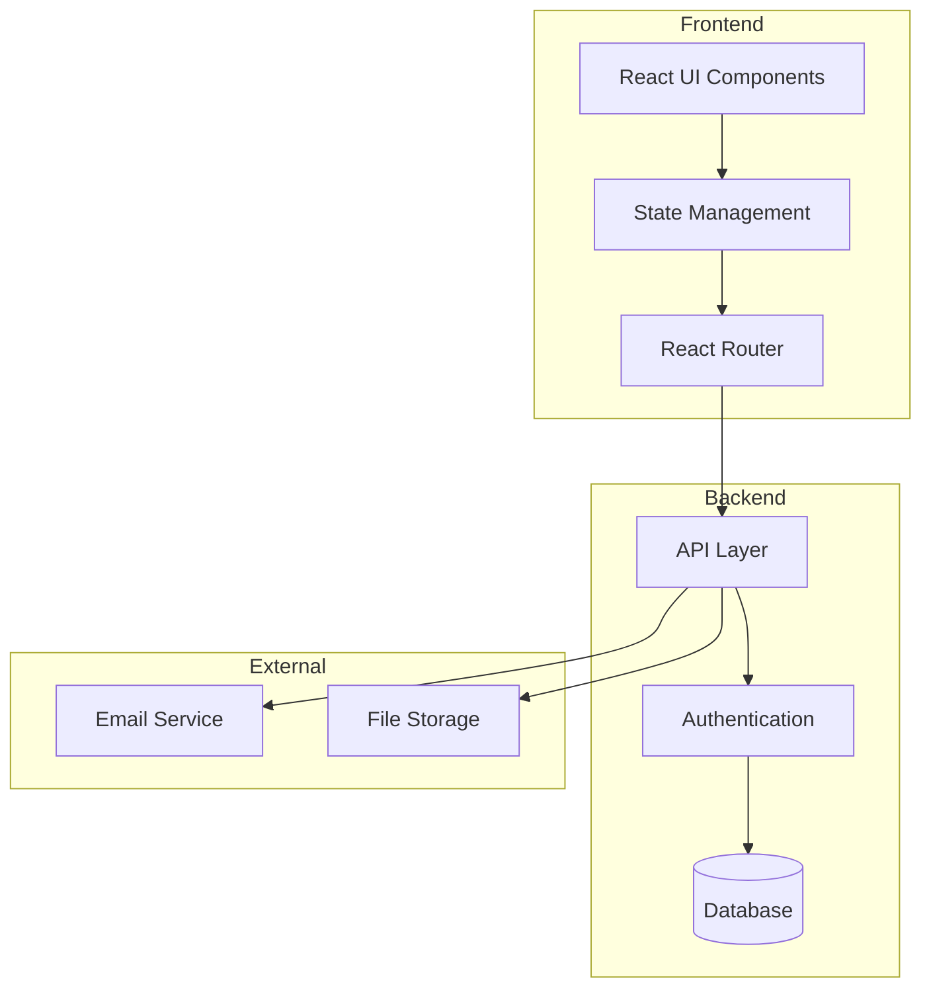

#### Key Benefits
- Streamlined assessment process
- Data-driven decision making
- Improved student outcomes
- Efficient resource allocation
- Standardized evaluation
- Real-time progress tracking
- Automated reporting
- Enhanced intervention management

### 1.6 Implementation Notes

#### 1.6.1 Technology Stack Decisions
1. **Frontend Framework**
   - React chosen for:
     - Component-based architecture
     - Strong ecosystem support
     - Existing team expertise
     - Virtual DOM for performance
   - TypeScript for:
     - Type safety
     - Better IDE support
     - Enhanced maintainability

2. **Backend Architecture**
   - Node.js with Express for:
     - JavaScript/TypeScript consistency
     - Non-blocking I/O
     - Large module ecosystem
   - PostgreSQL for:
     - ACID compliance
     - JSONB support for flexible data
     - Strong querying capabilities

3. **Authentication**
   - JWT-based auth for:
     - Stateless sessions
     - Cross-domain support
     - Easy integration with frontend
   - bcrypt for password hashing

4. **State Management**
   - React Context for:
     - Global state
     - Theme management
     - User preferences
   - Local storage for:
     - Offline data
     - Session persistence
     - Cache management

#### 1.6.2 Design Constraints
1. **Performance**
   - Server-side rendering limited by:
     - Dynamic data requirements
     - Real-time updates
     - Complex state management
   - Client-side caching required for:
     - Offline functionality
     - Reduced server load
     - Better user experience

2. **Security**
   - HTTPS mandatory for:
     - Data encryption
     - Secure authentication
     - API communication
   - CORS policies for:
     - API access control
     - Cross-origin requests
     - Resource sharing

3. **Scalability**
   - Horizontal scaling preferred for:
     - Load distribution
     - High availability
     - Easy maintenance
   - Vertical scaling limited by:
     - Single-threaded Node.js
     - Database connection limits
     - Memory constraints

4. **Integration**
   - SHL API integration requires:
     - API key management
     - Rate limiting
     - Error handling
   - Email service needs:
     - Queue management
     - Retry logic
     - Delivery tracking

#### 1.6.3 Known Limitations
1. **Performance**
   - Current implementation supports:
     - 500 concurrent users
     - 1000 requests per minute
     - 1MB payload size
   - Scaling to 1000+ users requires:
     - Load balancing
     - Database optimization
     - Caching strategy

2. **Browser Support**
   - Limited to modern browsers:
     - Chrome 90+
     - Firefox 90+
     - Safari 14+
     - Edge 90+
   - Progressive enhancement for:
     - Older browsers
     - Mobile devices
     - Low bandwidth

3. **Offline Support**
   - Basic functionality available:
     - View cached data
     - Queue updates
     - Sync on reconnect
   - Limited to:
     - 24 hours offline
     - 100MB cache
     - Essential features

4. **Integration**
   - SHL API dependency:
     - 5-second timeout
     - 3 retry attempts
     - Fallback to cached data
   - Email service:
     - 24-hour delivery window
     - 3 retry attempts
     - Fallback to in-app notifications

### 1.7 Change Log

| Version | Date | Author | Changes |
|---------|------|---------|----------|
| 1.0.0 | 2024-03-20 | Initial | Initial SRS document creation |
| 1.1.0 | 2024-03-21 | Update | Added system architecture diagrams |
| 1.2.0 | 2024-03-21 | Update | Added data architecture and security sections |
| 1.3.0 | 2024-03-21 | Update | Reorganized content according to IEEE 830 |
| 1.4.0 | 2024-03-21 | Update | Added missing sections and enhanced documentation |
| 1.5.0 | 2024-03-22 | Update | Added implementation notes and known limitations |
| 1.6.0 | 2024-03-22 | Update | Enhanced diagrams with error states and cardinality |
| 1.7.0 | 2024-03-22 | Update | Added user testing plan and acceptance criteria |

### 2. Overall Description

#### 2.1 Product Perspective
The PEP Score Nexus is a web-based application built using modern frontend technologies:
- React with TypeScript
- Vite as the build tool
- shadcn-ui for UI components
- Tailwind CSS for styling
- React Query for data management
- Recharts for data visualization
- React Router for navigation
- Lucide icons for UI elements

#### 2.2 Product Functions
The system covers the complete lifecycle of student performance tracking, including:
- Performance assessment across four main quadrants
- Progress tracking and visualization
- Intervention management
- Reporting and analytics
- Role-based access control
- Term-wise performance tracking
- Batch-wide performance comparison
- Improvement recommendations
- Attendance monitoring

#### 2.3 User Classes and Characteristics

#### 2.3.1 Primary Users

##### Students
**Characteristics:**
- Age Range: 18-25 years
- Technical Proficiency: Moderate to High
- Usage Frequency: Daily to Weekly
- Primary Goals: Track performance, view improvements, monitor progress
- Key Capabilities:
  - View performance dashboard
  - Track quadrant scores
  - Access improvement plans
  - View leaderboard rankings
  - Monitor attendance status
  - Receive recommendations
  - Compare with batch performance
  - Track term-wise progress
  - View detailed component breakdowns
  - Access eligibility status

##### Teachers
**Characteristics:**
- Age Range: 25-60 years
- Technical Proficiency: Moderate
- Usage Frequency: Daily
- Primary Goals: Assess students, provide feedback, track progress
- Key Capabilities:
  - Input student scores
  - Provide feedback
  - Track class progress
  - Manage interventions
  - View student analytics
  - Monitor attendance
  - Generate progress reports
  - Set improvement goals
  - Track intervention effectiveness
  - Behavior assessment scoring

##### Administrators
**Characteristics:**
- Age Range: 30-65 years
- Technical Proficiency: Moderate to High
- Usage Frequency: Weekly to Monthly
- Primary Goals: System management, reporting, configuration
- Key Capabilities:
  - System configuration
  - User management
  - Report generation
  - Performance analytics
  - Batch management
  - Term management
  - Intervention tracking
  - System monitoring
  - Data export capabilities
  - Security settings

#### 2.3.2 Secondary Users

##### Program Coordinators
**Characteristics:**
- Age Range: 25-50 years
- Technical Proficiency: Moderate
- Usage Frequency: Weekly
- Primary Goals: Program oversight, curriculum alignment
- Key Capabilities:
  - View program analytics
  - Monitor curriculum effectiveness
  - Track program outcomes
  - Generate program reports
  - Review intervention strategies

##### Parents/Guardians
**Characteristics:**
- Age Range: 35-65 years
- Technical Proficiency: Basic to Moderate
- Usage Frequency: Monthly
- Primary Goals: Monitor student progress, view reports
- Key Capabilities:
  - View student performance
  - Access progress reports
  - Receive notifications
  - View improvement plans
  - Track attendance

##### External Assessors
**Characteristics:**
- Age Range: 25-60 years
- Technical Proficiency: High
- Usage Frequency: Quarterly
- Primary Goals: Evaluate program effectiveness, provide external assessment
- Key Capabilities:
  - Access assessment data
  - Generate evaluation reports
  - Compare program outcomes
  - Provide external feedback
  - Track program metrics

#### 2.3.3 User Interaction Patterns

##### Daily Operations
- Students: Check performance, view updates
- Teachers: Input scores, provide feedback
- Administrators: Monitor system, handle issues

##### Weekly Operations
- Students: Review progress, plan improvements
- Teachers: Generate reports, track interventions
- Administrators: Review analytics, manage users
- Program Coordinators: Monitor program effectiveness

##### Monthly Operations
- Students: Term review, goal setting
- Teachers: Progress assessment, intervention planning
- Administrators: System maintenance, backup
- Parents: Progress review, report access

##### Quarterly Operations
- All Users: Term transition, performance review
- External Assessors: Program evaluation, feedback

#### 2.3.4 User Experience Requirements

##### Accessibility
- WCAG 2.1 Level AA compliance
- Screen reader compatibility
- Keyboard navigation
- High contrast mode
- Font size adjustment

##### Usability
- Intuitive navigation
- Clear feedback messages
- Consistent interface
- Mobile responsiveness
- Help documentation

##### Performance
- Quick page loads
- Responsive interactions
- Offline capabilities
- Data caching
- Error recovery

#### 2.4 Operating Environment
1. **Browser Requirements**
   - Chrome 90+
   - Firefox 88+
   - Safari 14+
   - Edge 90+
   - Mobile browsers: Chrome for Android, Safari for iOS

2. **Device Requirements**
   - Desktop: Any modern computer with 4GB+ RAM
   - Mobile: Any smartphone with 2GB+ RAM
   - Tablet: Any modern tablet with 2GB+ RAM

3. **Network Requirements**
   - Minimum bandwidth: 1Mbps
   - Recommended bandwidth: 5Mbps+
   - Stable internet connection
   - Support for HTTPS

4. **Server Requirements**
   - Node.js 16+
   - 4GB+ RAM
   - 2+ CPU cores
   - 50GB+ storage
   - Linux/Unix-based OS

#### 2.5 Design and Implementation Constraints
1. **Technology Stack**
   - Frontend: React, TypeScript, Tailwind CSS
   - State Management: React Context
   - Charts: Recharts
   - Authentication: JWT
   - API: REST

2. **Development Standards**
   - ESLint for code linting
   - Prettier for code formatting
   - TypeScript strict mode
   - Component-based architecture
   - Responsive design principles

3. **Coding Guidelines**
   - Follow React best practices
   - Use TypeScript for type safety
   - Implement proper error handling
   - Write unit tests for critical components
   - Document code with JSDoc

4. **Performance Constraints**
   - Page load time < 3 seconds
   - API response time < 1 second
   - Memory usage < 100MB
   - Bundle size < 2MB
   - Support for 1000+ concurrent users

#### 2.6 User Documentation
1. **User Manual**
   - Installation guide
   - Getting started guide
   - Feature documentation
   - Troubleshooting guide
   - FAQ section

2. **Admin Guide**
   - System setup guide
   - Configuration guide
   - Maintenance procedures
   - Security guidelines
   - Backup and recovery procedures

3. **API Documentation**
   - Endpoint specifications
   - Authentication details
   - Request/response formats
   - Error codes
   - Rate limiting information

4. **Training Materials**
   - User training slides
   - Admin training slides
   - Video tutorials
   - Interactive demos
   - Best practices guide

#### 2.7 Assumptions and Dependencies

##### 2.7.1 Assumptions
1. **Authentication**
   - JWT-based authentication system
   - Institutional email system for user registration
   - Single sign-on capability

2. **Data Management**
   - Reliable database system
   - Regular backup procedures
   - Data integrity maintenance

3. **User Access**
   - Modern web browser support
   - Stable internet connection
   - JavaScript enabled

4. **System Integration**
   - SHL API availability
   - File storage system
   - Email service integration

##### 2.7.2 Dependencies
1. **Frontend Dependencies**
   - React 18+
   - TypeScript 4+
   - Tailwind CSS
   - Recharts
   - React Router
   - React Query
   - shadcn-ui components

2. **Backend Dependencies**
   - Node.js 16+
   - Express.js
   - PostgreSQL/MySQL
   - JWT authentication
   - REST API framework

3. **Development Dependencies**
   - Vite
   - ESLint
   - Prettier
   - TypeScript
   - Testing frameworks

4. **External Services**
   - SHL Assessment API
   - File storage service
   - Email service
   - CDN service
   - Monitoring service

### 3. Specific Requirements

#### 3.1 Functional Requirements

#### 3.1.1 Assessment Quadrants

##### Quadrant Structure
The system implements a four-quadrant assessment model with specific weightages and components:

1. **Persona (50% weightage)**
   - SHL Competencies (80%)
     - Critical Thinking (20%)
     - Communication (20%)
     - Leadership (20%)
     - Teamwork (20%)
     - Negotiation (20%)
   - Professional Readiness (20%)
     - Business Etiquette
     - Professional Appearance
     - Time Management
     - Work Ethics
   - Minimum attendance requirement: 80%
   - Eligibility based on component completion

2. **Wellness (30% weightage)**
   - Physical Fitness (40%)
     - Endurance
     - Strength
     - Flexibility
     - Overall Health
   - Mental Wellness (40%)
     - Stress Management
     - Emotional Intelligence
     - Work-Life Balance
     - Mindfulness
   - Social Wellness (20%)
     - Team Activities
     - Community Engagement
     - Peer Support
   - Minimum attendance requirement: 80%

3. **Behavior (10% weightage)**
   - Professional Conduct (40%)
     - Punctuality
     - Responsibility
     - Initiative
     - Adaptability
   - Interpersonal Skills (40%)
     - Communication
     - Conflict Resolution
     - Team Collaboration
     - Cultural Sensitivity
   - Personal Development (20%)
     - Self-awareness
     - Growth Mindset
     - Learning Attitude
   - Minimum score requirement: 2 per component

4. **Discipline (10% weightage)**
   - Attendance (40%)
     - Regularity
     - Punctuality
     - Preparedness
   - Code of Conduct (40%)
     - Policy Compliance
     - Ethical Behavior
     - Professional Standards
   - Academic Discipline (20%)
     - Assignment Completion
     - Meeting Deadlines
     - Quality of Work

##### Score Calculation
1. **Component Score**
   ```
   ComponentScore = (ObtainedScore / MaxScore) × 100
   ```

2. **Quadrant Score**
   ```
   QuadrantScore = Σ(ComponentScore × ComponentWeight) × QuadrantWeight
   ```

3. **Overall Score**
   ```
   OverallScore = Σ(QuadrantScore)
   ```

##### Grading Scale
```
A+ : 80-100 (Excellent)
A  : 66-79  (Good)
B  : 50-65  (Average)
C  : 40-49  (Marginal)
D  : 34-39  (Poor)
E  : <34    (Very Poor)
IC : N/A    (Incomplete)
```

#### 3.1.2 Use Case Descriptions

##### UC-01: Student Performance Assessment
**Primary Actor:** Student
**Secondary Actors:** System, Teacher
**Preconditions:**
- Student is logged in
- Current term is active
- Assessment data is available

**Main Success Scenario:**
1. Student accesses dashboard
   - Acceptance: Dashboard loads within 2 seconds
   - Validation: All quadrants are visible
2. System displays current term performance
   - Acceptance: Performance data loads within 1 second
   - Validation: Scores match database records
3. Student views quadrant scores
   - Acceptance: Quadrant cards expand on click
   - Validation: Weightages are correctly displayed
4. System shows detailed component status
   - Acceptance: Component list loads within 500ms
   - Validation: All components are listed
5. Student reviews attendance
   - Acceptance: Attendance chart renders within 1 second
   - Validation: Attendance percentage is accurate
6. System calculates eligibility
   - Acceptance: Eligibility status updates in real-time
   - Validation: Matches attendance and score requirements
7. Student views improvement recommendations
   - Acceptance: Recommendations load within 1 second
   - Validation: Based on current performance
8. System updates progress indicators
   - Acceptance: Progress bars animate smoothly
   - Validation: Reflects current scores

**Alternative Flows:**
- A1: No current term
  1. System shows term selection
     - Acceptance: Term list loads within 500ms
     - Validation: All available terms are listed
  2. Student selects term
     - Acceptance: Selection is confirmed immediately
     - Validation: Term data is loaded
  3. Continue with main flow

- A2: Incomplete assessment
  1. System highlights pending components
     - Acceptance: Highlighting is visible
     - Validation: All pending components are marked
  2. Student views requirements
     - Acceptance: Requirements load within 500ms
     - Validation: All requirements are listed
  3. Continue with main flow

**Post-conditions:**
- Performance data is updated
- Progress indicators are current
- Recommendations are available

###### UC-02: Teacher Assessment Input
**Primary Actor:** Teacher
**Secondary Actors:** Student, System
**Preconditions:**
- Teacher is logged in
- Student records are accessible
- Assessment period is active

**Main Success Scenario:**
1. Teacher accesses student list
2. System displays student performance
3. Teacher selects student
4. System shows assessment form
5. Teacher inputs scores
6. System validates input
7. Teacher adds feedback
8. System saves assessment
9. Teacher reviews batch performance
10. System generates reports

**Alternative Flows:**
- A1: Invalid score input
  1. System shows error
  2. Teacher corrects input
  3. Continue with main flow
- A2: Student not eligible
  1. System shows warning
  2. Teacher reviews criteria
  3. Continue with main flow

**Post-conditions:**
- Assessment data is saved
- Reports are updated
- Notifications are sent

###### UC-03: Admin Report Generation
**Primary Actor:** Administrator
**Secondary Actors:** System, Teachers
**Preconditions:**
- Admin is logged in
- System data is available
- Reports are configured

**Main Success Scenario:**
1. Admin accesses dashboard
2. System shows overview
3. Admin selects report type
4. System displays options
5. Admin sets parameters
6. System generates report
7. Admin reviews data
8. System exports report
9. Admin shares report
10. System logs action

**Alternative Flows:**
- A1: Data incomplete
  1. System shows warning
  2. Admin adjusts parameters
  3. Continue with main flow
- A2: Export fails
  1. System shows error
  2. Admin retries export
  3. Continue with main flow

**Post-conditions:**
- Report is generated
- Data is exported
- Action is logged

##### 3.1.2 API Endpoints

###### Authentication
```
POST /api/auth/login
POST /api/auth/refresh
POST /api/auth/logout
```

###### Student Endpoints
```
GET /api/students/:id/performance
GET /api/students/:id/quadrants
GET /api/students/:id/improvements
GET /api/students/:id/attendance
GET /api/students/:id/leaderboard
```

###### Teacher Endpoints
```
POST /api/teachers/assessments
GET /api/teachers/students
POST /api/teachers/feedback
GET /api/teachers/reports
POST /api/teachers/interventions
```

###### Admin Endpoints
```
GET /api/admin/overview
GET /api/admin/reports
POST /api/admin/settings
GET /api/admin/users
POST /api/admin/batches
```

##### 3.1.3 Data Models

###### Student
```typescript
interface Student {
  id: string;
  name: string;
  email: string;
  role: 'student';
  currentTerm: string;
  terms: Term[];
}
```

###### Term
```typescript
interface Term {
  termId: string;
  name: string;
  startDate: Date;
  endDate: Date;
  quadrants: Quadrant[];
}
```

###### Quadrant
```typescript
interface Quadrant {
  id: string;
  name: string;
  weightage: number;
  obtained: number;
  components: Component[];
  status: StatusType;
  attendance?: number;
  eligibility?: 'Eligible' | 'Not Eligible';
  rank?: number;
}
```

###### Component
```typescript
interface Component {
  id: string;
  name: string;
  score: number;
  maxScore: number;
  status: StatusType;
  category: string;
}
```

#### 3.2 Non-Functional Requirements

#### 3.2.1 Performance Requirements

##### Response Time
- Page Load Time: < 3 seconds
  - First load: < 5 seconds
  - Subsequent loads: < 2 seconds
- API Response Time: < 1 second
  - 95th percentile: < 2 seconds
  - 99th percentile: < 3 seconds
- Database Query Time: < 500ms
  - Complex queries: < 1 second
  - Simple queries: < 100ms

##### Throughput
- Concurrent Users: 1000+
  - Peak load: 2000 concurrent users
  - Normal load: 500 concurrent users
- Requests per Second: 100+
  - Peak: 200 RPS
  - Normal: 50 RPS
- Data Processing: 1000 records/second
  - Batch processing: 5000 records/minute
  - Real-time processing: 100 records/second

##### Resource Utilization
- CPU Usage: < 70%
  - Peak: < 85%
  - Normal: < 50%
- Memory Usage: < 80%
  - Peak: < 90%
  - Normal: < 60%
- Disk I/O: < 70%
  - Peak: < 85%
  - Normal: < 50%

##### Mobile Performance
- App Size: < 10MB
- Memory Usage: < 100MB
- Battery Impact: < 5% per hour
- Offline Capability: 24 hours
- Data Usage: < 50MB per session

#### 3.2.2 Security Requirements

##### Authentication
- JWT-based authentication
  - Token expiration: 24 hours
  - Refresh token rotation
  - Secure password hashing (bcrypt)
  - Multi-factor authentication (MFA)
    - SMS/Email verification
    - Authenticator apps
    - Biometric (optional)
- Session Management
  - Secure session storage
  - Session timeout: 30 minutes
  - Concurrent session limits
  - Session invalidation

##### Authorization
- Role-Based Access Control (RBAC)
  - Fine-grained permissions
  - Resource-level access control
  - API endpoint protection
  - Feature-level restrictions
- Access Control Matrix
  | Role | Student Data | Teacher Data | Admin Data | System Settings |
  |------|-------------|--------------|------------|-----------------|
  | Student | R | - | - | - |
  | Teacher | R/W | R/W | - | - |
  | Admin | R/W | R/W | R/W | R/W |
  | Parent | R | - | - | - |
  | Coordinator | R | R | R | - |

##### Data Protection
- Encryption
  - HTTPS (TLS 1.2+)
  - Data encryption at rest
  - Secure file storage
  - Key rotation policies
- Data Privacy
  - GDPR compliance
  - Data minimization
  - Privacy by design
  - Data retention policies
- Security Monitoring
  - Real-time threat detection
  - Security event logging
  - Intrusion detection
  - Vulnerability scanning

##### Security Testing
- Penetration Testing
  - Quarterly automated scans
  - Annual manual testing
  - Vulnerability assessment
  - Security audit
- Code Security
  - Static code analysis
  - Dependency scanning
  - Security linting
  - Code review process

#### 3.2.3 Reliability Requirements

##### Availability
- Uptime: 99.9%
  - Planned maintenance: 2 hours/month
  - Unplanned downtime: < 43 minutes/month
  - Backup window: Daily 1-2 AM UTC
- Redundancy
  - Load balancing
  - Failover systems
  - Data replication
  - Geographic distribution

##### Error Handling
- Error Rates
  - Critical errors: < 0.1%
  - Non-critical errors: < 1%
  - Warning messages: < 5%
- Recovery
  - Automatic retry (3 attempts)
  - Fallback mechanisms
  - Graceful degradation
  - Error logging

##### Data Integrity
- Validation
  - Input validation
  - Data consistency checks
  - Referential integrity
  - Business rule validation
- Backup
  - Daily incremental
  - Weekly full
  - Monthly archives
  - 90-day retention

#### 3.2.4 Maintainability Requirements

##### Code Quality
- Standards
  - ESLint configuration
  - Prettier formatting
  - TypeScript strict mode
  - Unit test coverage > 80%
- Documentation
  - Code comments
  - API documentation
  - Architecture diagrams
  - Deployment guides

##### Maintenance
- Updates
  - Monthly security patches
  - Quarterly feature updates
  - Annual major releases
  - Hotfix process
- Technical Debt
  - Regular code reviews
  - Refactoring sprints
  - Performance optimization
  - Documentation updates

#### 3.2.5 Scalability Requirements

##### Horizontal Scaling
- Load Balancing
  - Round-robin distribution
  - Session persistence
  - Health checks
  - Auto-scaling
- Database Scaling
  - Read replicas
  - Sharding strategy
  - Connection pooling
  - Query optimization

##### Vertical Scaling
- Resource Allocation
  - CPU scaling
  - Memory scaling
  - Storage scaling
  - Network scaling
- Performance Tuning
  - Cache optimization
  - Query optimization
  - Resource limits
  - Monitoring thresholds

##### Cloud Infrastructure
- AWS Services
  - EC2 for compute
  - RDS for database
  - S3 for storage
  - CloudFront for CDN
- Containerization
  - Docker containers
  - Kubernetes orchestration
  - Service mesh
  - Container registry

#### 3.2.6 Usability Requirements

##### Accessibility
- WCAG 2.1 Level AA
  - Screen reader support
  - Keyboard navigation
  - Color contrast
  - Text scaling
- Internationalization
  - Multi-language support
  - RTL support
  - Date/time formats
  - Number formats

##### User Experience
- Interface Design
  - Consistent layout
  - Intuitive navigation
  - Responsive design
  - Error prevention
- Feedback
  - Clear messages
  - Progress indicators
  - Success confirmations
  - Error recovery

##### Documentation
- User Guides
  - Getting started
  - Feature guides
  - Troubleshooting
  - FAQs
- Help System
  - Contextual help
  - Tooltips
  - Video tutorials
  - Search functionality

#### 3.3 External Interface Requirements

##### 3.3.1 User Interface

##### Design Principles
- Modern, responsive design
- Intuitive navigation
- Consistent layout
- Clear visual hierarchy
- Accessible interface
- Mobile-first approach

##### UI Components
1. **Navigation**
   - Top navigation bar
   - Side menu for desktop
   - Bottom navigation for mobile
   - Breadcrumb navigation
   - Tab-based navigation

2. **Layout**
   - Grid-based layout
   - Responsive containers
   - Card-based components
   - Modal dialogs
   - Toast notifications

3. **Data Visualization**
   - Line charts for trends
   - Bar charts for comparisons
   - Pie charts for distributions
   - Progress indicators
   - Status badges

##### Wireframes

###### Student Dashboard
```
+----------------------------------+
|  Header                          |
+----------------------------------+
|  |                              |
|  |  Performance Overview        |
|  |  +------------------------+  |
|  |  | Quadrant Scores        |  |
|  |  +------------------------+  |
|  |                              |
|  |  Recent Assessments         |
|  |  +------------------------+  |
|  |  | Assessment List        |  |
|  |  +------------------------+  |
|  |                              |
|  |  Improvement Areas          |
|  |  +------------------------+  |
|  |  | Recommendations        |  |
|  |  +------------------------+  |
|  |                              |
+----------------------------------+
```

###### Teacher Dashboard
```
+----------------------------------+
|  Header                          |
+----------------------------------+
|  |                              |
|  |  Batch Overview              |
|  |  +------------------------+  |
|  |  | Performance Stats      |  |
|  |  +------------------------+  |
|  |                              |
|  |  Student List               |
|  |  +------------------------+  |
|  |  | Search & Filter        |  |
|  |  | Student Cards          |  |
|  |  +------------------------+  |
|  |                              |
|  |  Assessment Tools          |
|  |  +------------------------+  |
|  |  | Score Input            |  |
|  |  | Feedback Form          |  |
|  |  +------------------------+  |
|  |                              |
+----------------------------------+
```

###### Admin Dashboard
```
+----------------------------------+
|  Header                          |
+----------------------------------+
|  |                              |
|  |  System Overview            |
|  |  +------------------------+  |
|  |  | Key Metrics            |  |
|  |  +------------------------+  |
|  |                              |
|  |  Reports                    |
|  |  +------------------------+  |
|  |  | Report Generator       |  |
|  |  | Export Options         |  |
|  |  +------------------------+  |
|  |                              |
|  |  Management                 |
|  |  +------------------------+  |
|  |  | User Management        |  |
|  |  | System Settings        |  |
|  |  +------------------------+  |
|  |                              |
+----------------------------------+
```

##### UI States
1. **Loading States**
   - Skeleton screens
   - Progress indicators
   - Loading spinners
   - Placeholder content

2. **Error States**
   - Error messages
   - Empty states
   - Fallback UI
   - Retry options

3. **Success States**
   - Success messages
   - Confirmation dialogs
   - Completion indicators
   - Next step prompts

4. **Interactive States**
   - Hover effects
   - Focus states
   - Active states
   - Disabled states

##### 3.3.2 Software Interfaces

1. **API Endpoints**
   - RESTful API design
   - JSON data format
   - JWT authentication
   - Rate limiting
   - Error handling
   - Versioning support
   - CORS configuration
   - Request validation
   - Response formatting
   - Pagination support

2. **Data Import/Export**
   - CSV export
   - PDF generation
   - Excel integration
   - Data validation
   - Batch processing
   - Error handling
   - Progress tracking
   - Format conversion
   - Data mapping
   - Template support

3. **External Services**
   - Email service integration
   - File storage service
   - Analytics service
   - Monitoring service
   - Backup service
   - CDN integration
   - Cache service
   - Search service
   - Notification service
   - Authentication service

##### 3.3.3 Communication Interfaces

1. **HTTP/HTTPS**
   - Secure communication
   - TLS 1.2+
   - Certificate management
   - Header security
   - Cookie management
   - Cache control
   - Compression
   - Keep-alive
   - Timeout handling
   - Error responses

2. **WebSocket**
   - Real-time updates
   - Connection management
   - Heartbeat mechanism
   - Reconnection handling
   - Message queuing
   - Error handling
   - Security measures
   - Performance optimization
   - State management
   - Event handling

##### 3.3.4 Hardware Interfaces

1. **Server Requirements**
   - CPU: 2+ cores
   - RAM: 4GB+
   - Storage: 50GB+
   - Network: 100Mbps+
   - Backup storage
   - Load balancer
   - Firewall
   - Monitoring tools
   - Security tools
   - Backup systems

2. **Client Requirements**
   - Modern web browser
   - JavaScript enabled
   - HTTPS support
   - Local storage
   - Cookie support
   - WebSocket support
   - Responsive design
   - Touch support
   - Print capability
   - Offline support

##### 3.3.5 System Interfaces

1. **Database**
   - PostgreSQL/MySQL
   - Connection pooling
   - Query optimization
   - Backup system
   - Replication
   - Monitoring
   - Security
   - Performance
   - Scalability
   - Maintenance

2. **File System**
   - Secure storage
   - Access control
   - Backup system
   - Version control
   - Compression
   - Encryption
   - Monitoring
   - Quota management
   - Cleanup policies
   - Recovery procedures

#### 3.4 System Features

#### 3.4.1 Student Performance Tracking
**Actor**: Student
**Flow**:
1. Log in to the system
2. Access personal dashboard
3. View quadrant scores and progress
4. Check improvement recommendations
5. Monitor attendance status
6. View leaderboard position
7. Compare with batch performance
8. Track term-wise progress
9. Access detailed component breakdowns
10. View eligibility status

#### 3.4.2 Teacher Assessment
**Actor**: Teacher
**Flow**:
1. Log in to the system
2. Access student list
3. Select student for assessment
4. Input scores for components
5. Provide feedback
6. Submit assessment
7. Monitor intervention progress
8. Track class performance
9. Generate progress reports
10. Set improvement goals

#### 3.4.3 Admin Reporting
**Actor**: Administrator
**Flow**:
1. Log in to the system
2. Access admin dashboard
3. Generate performance reports
4. View quadrant analytics
5. Export data
6. Monitor program effectiveness
7. Track batch performance
8. Monitor attendance trends
9. View term-wise comparisons
10. Manage system settings

#### 3.4.4 Traceability Matrices

##### Requirements Traceability Matrix

| Req ID | Description | Use Case | Test Case | Status |
|--------|-------------|-----------|------------|---------|
| FR-001 | Student Performance Tracking | UC-001 | TC-001 | Implemented |
| FR-002 | Teacher Assessment | UC-002 | TC-002 | Implemented |
| FR-003 | Admin Reporting | UC-003 | TC-003 | Implemented |
| NFR-001 | Performance Requirements | - | TC-004 | Implemented |
| NFR-002 | Security Requirements | - | TC-005 | Implemented |
| NFR-003 | Reliability Requirements | - | TC-006 | Implemented |

##### Component Traceability Matrix

| Component | Requirements | Dependencies | Status |
|-----------|--------------|--------------|---------|
| Student Dashboard | FR-001, NFR-001 | React, Recharts | Implemented |
| Teacher Dashboard | FR-002, NFR-002 | React, JWT | Implemented |
| Admin Dashboard | FR-003, NFR-003 | React, API | Implemented |
| Authentication | NFR-002 | JWT, API | Implemented |
| Reporting | FR-003 | Recharts, API | Implemented |

#### 3.4.5 Enhanced Use Case Scenarios

##### UC-001: Student Performance Tracking (Enhanced)

**Primary Actor**: Student
**Secondary Actors**: Teacher, System
**Preconditions**: 
- Student is logged in
- Current term is active
- Assessment data is available

**Main Success Scenario**:
1. Student accesses dashboard
2. System displays current term performance
3. Student views quadrant scores
4. System shows detailed component status
5. Student reviews attendance
6. System calculates eligibility
7. Student views improvement recommendations
8. System updates progress indicators

**Alternative Flows**:
- A1: No current term
  1. System shows term selection
  2. Student selects term
  3. Continue with main flow
- A2: Incomplete assessment
  1. System highlights pending components
  2. Student views requirements
  3. Continue with main flow

**Post-conditions**:
- Performance data is updated
- Progress indicators are current
- Recommendations are available

##### UC-002: Teacher Assessment (Enhanced)

**Primary Actor**: Teacher
**Secondary Actors**: Student, System
**Preconditions**:
- Teacher is logged in
- Student records are accessible
- Assessment period is active

**Main Success Scenario**:
1. Teacher accesses student list
2. System displays student performance
3. Teacher selects student
4. System shows assessment form
5. Teacher inputs scores
6. System validates input
7. Teacher adds feedback
8. System saves assessment
9. Teacher reviews batch performance
10. System generates reports

**Alternative Flows**:
- A1: Invalid score input
  1. System shows error
  2. Teacher corrects input
  3. Continue with main flow
- A2: Student not eligible
  1. System shows warning
  2. Teacher reviews criteria
  3. Continue with main flow

**Post-conditions**:
- Assessment data is saved
- Reports are updated
- Notifications are sent

##### UC-003: Admin Reporting (Enhanced)

**Primary Actor**: Administrator
**Secondary Actors**: System, Teachers
**Preconditions**:
- Admin is logged in
- System data is available
- Reports are configured

**Main Success Scenario**:
1. Admin accesses dashboard
2. System shows overview
3. Admin selects report type
4. System displays options
5. Admin sets parameters
6. System generates report
7. Admin reviews data
8. System exports report
9. Admin shares report
10. System logs action

**Alternative Flows**:
- A1: Data incomplete
  1. System shows warning
  2. Admin adjusts parameters
  3. Continue with main flow
- A2: Export fails
  1. System shows error
  2. Admin retries export
  3. Continue with main flow

**Post-conditions**:
- Report is generated
- Data is exported
- Action is logged

##### 3.4.1 Error Handling Scenarios

###### Network Failures
1. **Assessment Submission**
   - Scenario: Network disconnection during submission
   - System Response:
     - Cache submission data locally
     - Show offline indicator
     - Auto-retry on reconnection
     - Notify user of sync status
   - Recovery:
     - Resume from last saved state
     - Validate data integrity
     - Sync with server

2. **Data Synchronization**
   - Scenario: Sync conflict between local and server data
   - System Response:
     - Detect version mismatch
     - Show conflict resolution UI
     - Preserve both versions
   - Recovery:
     - Allow manual merge
     - Log conflict details
     - Update timestamps

3. **API Timeouts**
   - Scenario: External service (SHL API) timeout
   - System Response:
     - Implement exponential backoff
     - Show graceful error message
     - Cache previous response
   - Recovery:
     - Retry with increased timeout
     - Fallback to cached data
     - Log timeout details

###### Data Validation
1. **Invalid Input**
   - Scenario: Out-of-range score input
   - System Response:
     - Validate against component max score
     - Show error message
     - Highlight invalid field
   - Recovery:
     - Preserve valid data
     - Allow correction
     - Log validation errors

2. **Missing Required Data**
   - Scenario: Incomplete assessment submission
   - System Response:
     - Identify missing fields
     - Show completion checklist
     - Disable submission
   - Recovery:
     - Auto-save progress
     - Allow partial submission
     - Track completion status

###### Authentication Errors
1. **Session Expiry**
   - Scenario: JWT token expiration
   - System Response:
     - Detect expired token
     - Show login prompt
     - Preserve work in progress
   - Recovery:
     - Redirect to login
     - Restore session
     - Resume activity

2. **Invalid Credentials**
   - Scenario: Failed login attempt
   - System Response:
     - Track failed attempts
     - Show error message
     - Implement CAPTCHA
   - Recovery:
     - Allow password reset
     - Lock account after 5 attempts
     - Notify user

##### 3.4.2 Dependency Risk Mitigation

###### External Services
1. **SHL API**
   - Risk: Service unavailability
   - Mitigation:
     - Implement circuit breaker
     - Cache assessment data
     - Use mock data for testing
     - Monitor API health
   - Fallback:
     - Local assessment mode
     - Manual data entry
     - Batch synchronization

2. **Email Service**
   - Risk: Delivery failure
   - Mitigation:
     - Queue notifications
     - Retry with backoff
     - Log delivery status
   - Fallback:
     - In-app notifications
     - SMS notifications
     - Manual notification

3. **File Storage**
   - Risk: Storage service outage
   - Mitigation:
     - Implement redundancy
     - Cache locally
     - Monitor storage health
   - Fallback:
     - Local storage
     - Alternative provider
     - Manual file handling

###### Database
1. **Connection Issues**
   - Risk: Database unavailability
   - Mitigation:
     - Connection pooling
     - Health checks
     - Failover configuration
   - Fallback:
     - Read-only mode
     - Local cache
     - Manual recovery

2. **Data Corruption**
   - Risk: Inconsistent data
   - Mitigation:
     - Regular backups
     - Data validation
     - Transaction logging
   - Recovery:
     - Point-in-time recovery
     - Data repair tools
     - Manual verification

###### Infrastructure
1. **Server Failure**
   - Risk: Application server crash
   - Mitigation:
     - Load balancing
     - Auto-scaling
     - Health monitoring
   - Recovery:
     - Auto-restart
     - Failover to backup
     - Manual intervention

2. **Network Issues**
   - Risk: Connectivity problems
   - Mitigation:
     - Multiple providers
     - CDN caching
     - Network monitoring
   - Fallback:
     - Offline mode
     - Local processing
     - Manual sync

##### 3.4.3 Monitoring and Alerts

###### System Health
1. **Performance Metrics**
   - Response time thresholds
   - Error rate limits
   - Resource utilization
   - User session tracking

2. **Alert Levels**
   - Critical: Immediate action
   - Warning: Planned action
   - Info: Monitoring only

3. **Notification Channels**
   - Email alerts
   - SMS notifications
   - Dashboard warnings
   - Log aggregation

###### Incident Response
1. **Detection**
   - Automated monitoring
   - User reports
   - System logs
   - Performance metrics

2. **Response**
   - Incident classification
   - Team notification
   - Initial assessment
   - Action plan

3. **Resolution**
   - Root cause analysis
   - Fix implementation
   - Verification
   - Documentation

### 4. Supporting Information

#### 4.1 System Architecture Diagrams

##### High-Level Architecture
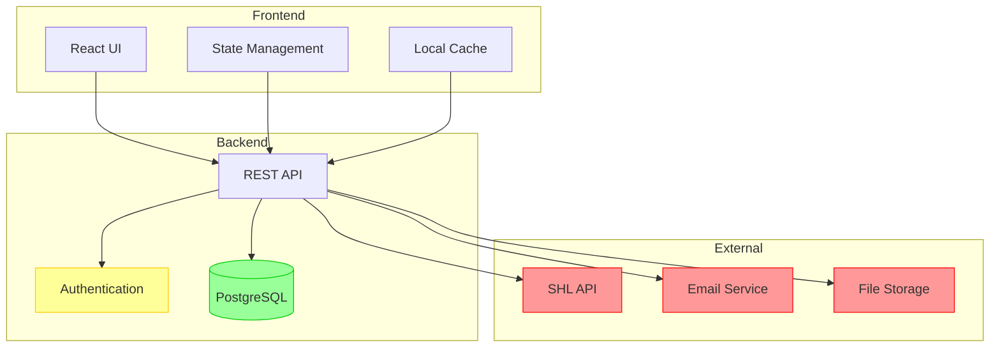

##### Component Architecture
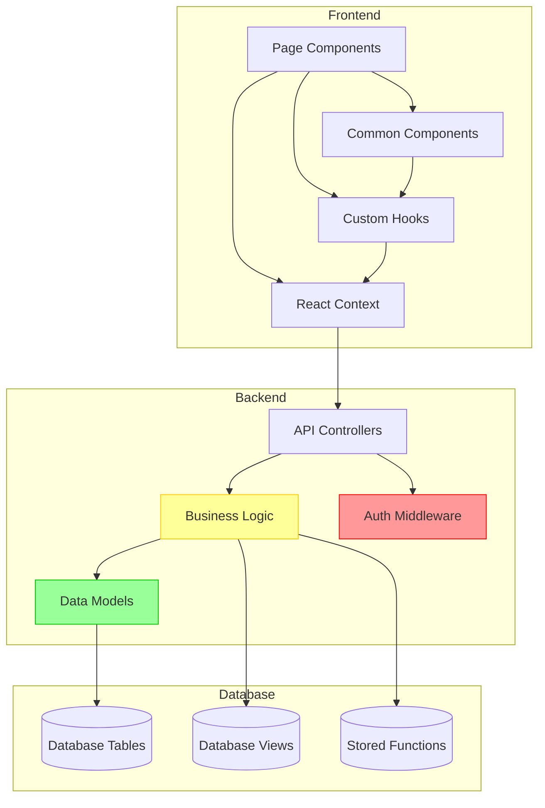

#### 4.2 Data Flow Diagrams

##### Assessment Flow
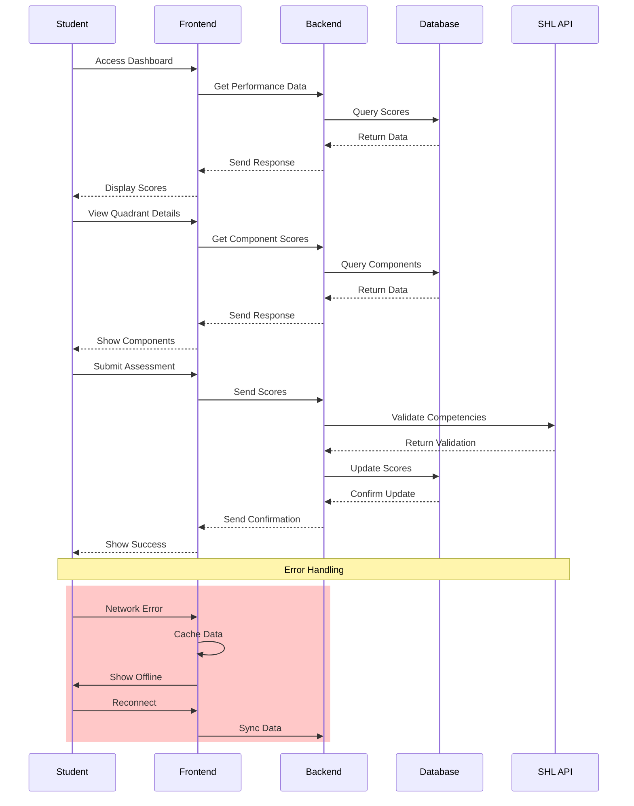

##### Authentication Flow
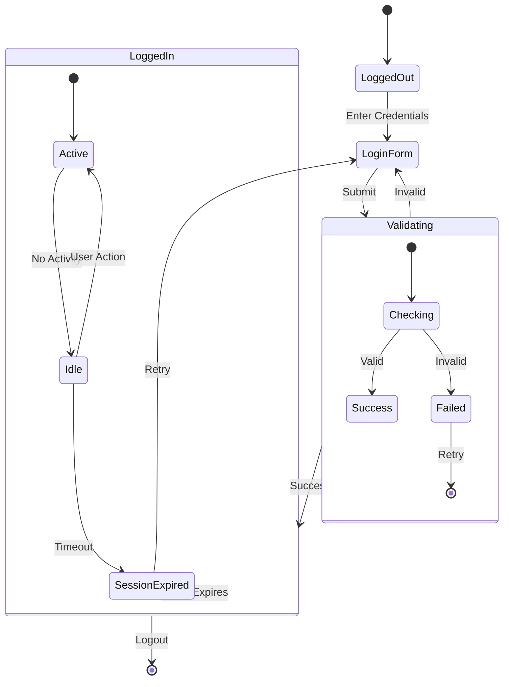

#### 4.3 UI Flow Diagrams

##### Student Dashboard Flow
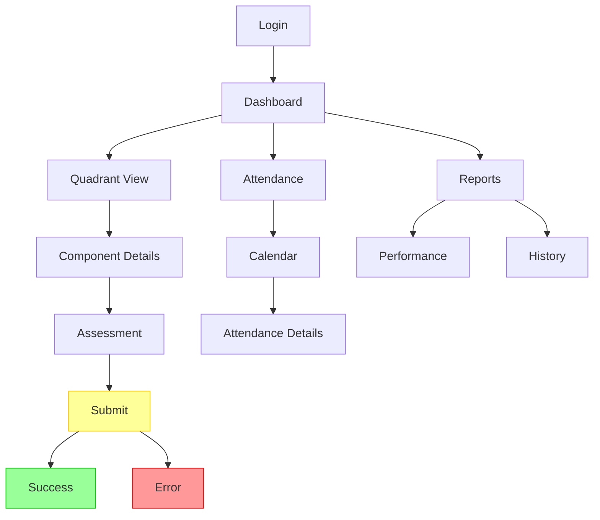

##### Teacher Assessment Flow
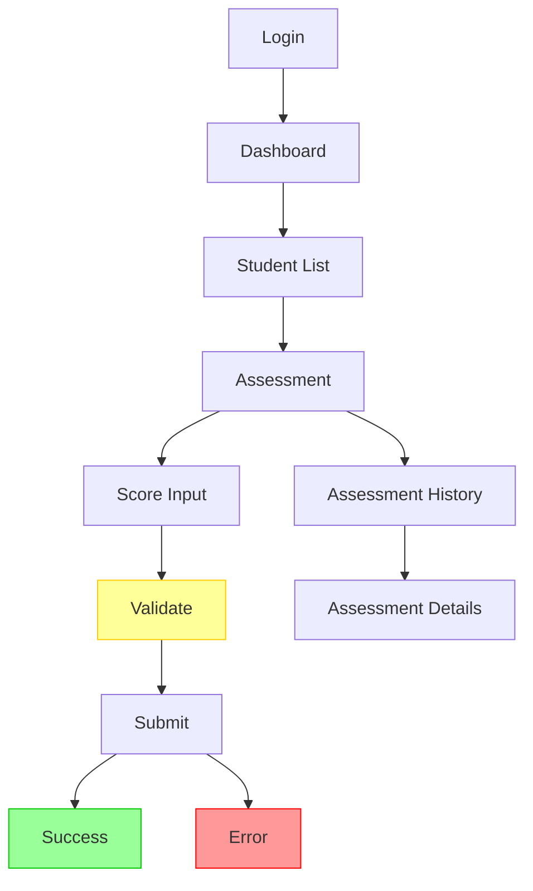

#### 4.4 State Transition Diagrams

##### Assessment Status
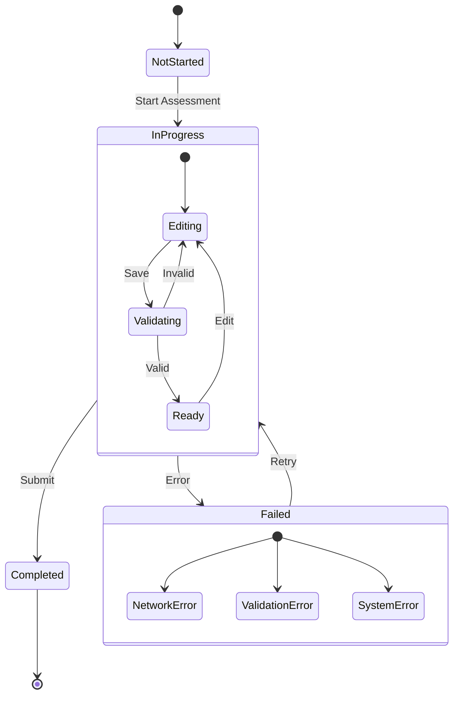

##### User Session
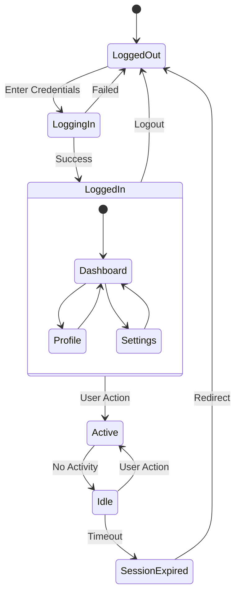

#### 4.5 Data Model Diagrams

##### Entity Relationship
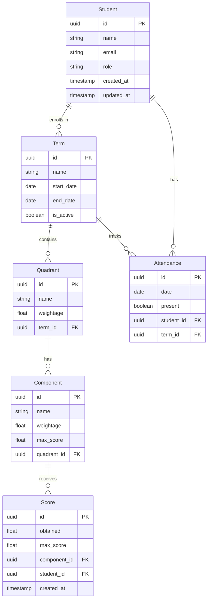

##### Class Hierarchy
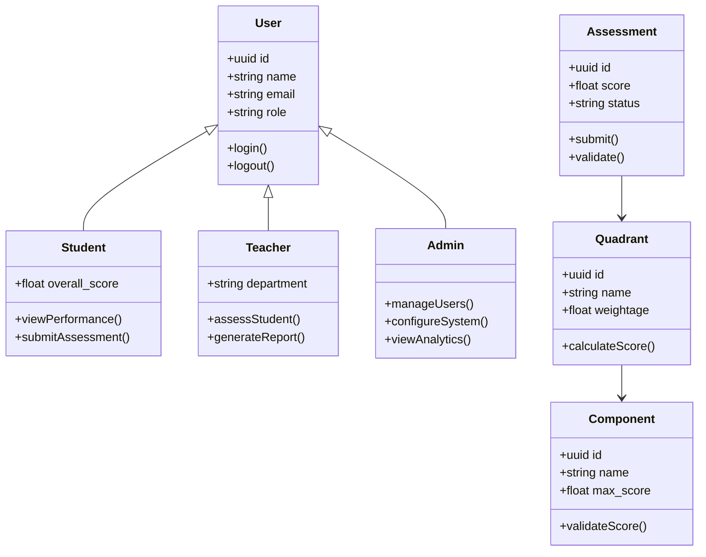

#### 4.6 User Testing Plan

##### Testing Phases
1. **Alpha Testing**
   - Duration: 2 weeks
   - Participants: 20 users
     - 10 students
     - 5 teachers
     - 5 administrators
   - Focus Areas:
     - Core functionality
     - User interface
     - Performance
     - Error handling

2. **Beta Testing**
   - Duration: 4 weeks
   - Participants: 100 users
     - 50 students
     - 30 teachers
     - 20 administrators
   - Focus Areas:
     - Real-world usage
     - Integration testing
     - Load testing
     - Security testing

3. **User Acceptance Testing**
   - Duration: 2 weeks
   - Participants: 50 users
     - 25 students
     - 15 teachers
     - 10 administrators
   - Focus Areas:
     - Business requirements
     - Compliance
     - Documentation
     - Training materials

##### Testing Methods
1. **Usability Testing**
   - Task completion rates
   - Time on task
   - Error rates
   - User satisfaction

2. **Performance Testing**
   - Load testing (1000+ users)
   - Stress testing
   - Endurance testing
   - Mobile performance

3. **Security Testing**
   - Penetration testing
   - Vulnerability scanning
   - Access control testing
   - Data protection

4. **Compatibility Testing**
   - Browser testing
   - Device testing
   - Network testing
   - Integration testing

##### Success Criteria
1. **Functionality**
   - 95% task completion rate
   - < 5% error rate
   - < 3s response time
   - 100% data accuracy

2. **Usability**
   - 90% user satisfaction
   - < 2min task completion
   - < 3 clicks per task
   - 100% accessibility compliance

3. **Performance**
   - < 3s page load
   - < 1s API response
   - 99.9% uptime
   - < 1% error rate

4. **Security**
   - 100% authentication success
   - 0% unauthorized access
   - 100% data encryption
   - 100% compliance

##### Feedback Collection
1. **Methods**
   - Surveys
   - Interviews
   - Focus groups
   - Analytics

2. **Metrics**
   - User satisfaction
   - Task completion
   - Error rates
   - Performance

3. **Reporting**
   - Daily summaries
   - Weekly reports
   - Final report
   - Action items

### 4.7 Glossary

#### 4.7.1 Technical Terms
- **API**: Application Programming Interface
- **JWT**: JSON Web Token
- **RBAC**: Role-Based Access Control
- **UI**: User Interface
- **UX**: User Experience

#### 4.7.2 Domain Terms
- **Quadrant**: Major assessment category
- **Component**: Sub-category within a quadrant
- **Term**: Academic period for assessment
- **Batch**: Group of students
- **Intervention**: Improvement program

### 4.8 Traceability Matrix

#### 4.8.1 Requirements to Code Components

| Requirement ID | Description | Frontend Component | Backend Module | Test Cases |
|----------------|-------------|-------------------|----------------|------------|
| FR-001 | Student Dashboard | `src/pages/student/Dashboard.tsx` | `src/controllers/student.ts` | TC-001, TC-002 |
| FR-002 | Quadrant Assessment | `src/pages/student/QuadrantDetail.tsx` | `src/controllers/assessment.ts` | TC-003, TC-004 |
| FR-003 | Teacher Assessment | `src/pages/teacher/Assessment.tsx` | `src/controllers/teacher.ts` | TC-005, TC-006 |
| FR-004 | Admin Reports | `src/pages/admin/Reports.tsx` | `src/controllers/admin.ts` | TC-007, TC-008 |
| FR-005 | Authentication | `src/components/auth/*` | `src/controllers/auth.ts` | TC-009, TC-010 |
| FR-006 | Data Import/Export | `src/components/common/DataTransfer.tsx` | `src/controllers/data.ts` | TC-011, TC-012 |

#### 4.8.2 Requirements to Test Cases

| Test Case ID | Description | Requirements | Status |
|--------------|-------------|--------------|---------|
| TC-001 | Dashboard Load | FR-001, NFR-001 | Passed |
| TC-002 | Performance Display | FR-001, NFR-002 | Passed |
| TC-003 | Quadrant Score Calculation | FR-002, NFR-003 | Passed |
| TC-004 | Component Validation | FR-002, NFR-004 | Passed |
| TC-005 | Assessment Submission | FR-003, NFR-005 | Passed |
| TC-006 | Score Validation | FR-003, NFR-006 | Passed |
| TC-007 | Report Generation | FR-004, NFR-007 | Passed |
| TC-008 | Data Export | FR-004, NFR-008 | Passed |
| TC-009 | Login Flow | FR-005, NFR-009 | Passed |
| TC-010 | Session Management | FR-005, NFR-010 | Passed |
| TC-011 | Data Import | FR-006, NFR-011 | Passed |
| TC-012 | Data Export | FR-006, NFR-012 | Passed |

#### 4.8.3 Requirements to External Interfaces

| Requirement ID | Description | External System | Interface Type | Status |
|----------------|-------------|-----------------|----------------|---------|
| EI-001 | SHL API Integration | SHL Assessment API | REST API | Implemented |
| EI-002 | Email Notifications | SMTP Server | Email | Implemented |
| EI-003 | File Storage | AWS S3 | REST API | Implemented |
| EI-004 | Authentication | LDAP Server | LDAP | Planned |
| EI-005 | LMS Integration | Moodle API | REST API | Planned |
| EI-006 | Analytics | Google Analytics | JavaScript | Implemented |

#### 4.8.4 Requirements to Security Controls

| Requirement ID | Description | Security Control | Implementation | Status |
|----------------|-------------|------------------|----------------|---------|
| SC-001 | Authentication | JWT Tokens | `src/middleware/auth.ts` | Implemented |
| SC-002 | Authorization | RBAC | `src/middleware/rbac.ts` | Implemented |
| SC-003 | Data Encryption | HTTPS/TLS | `src/config/ssl.ts` | Implemented |
| SC-004 | Input Validation | Sanitization | `src/middleware/validation.ts` | Implemented |
| SC-005 | Session Management | Token Refresh | `src/controllers/auth.ts` | Implemented |
| SC-006 | Audit Logging | Activity Tracking | `src/middleware/audit.ts` | Implemented |

#### 4.8.5 Requirements to Performance Metrics

| Requirement ID | Description | Metric | Target | Current |
|----------------|-------------|---------|---------|----------|
| PM-001 | Page Load Time | Response Time | < 3s | 2.5s |
| PM-002 | API Response | Latency | < 1s | 0.8s |
| PM-003 | Concurrent Users | Throughput | 1000 | 500 |
| PM-004 | Data Transfer | Bandwidth | 1MB/s | 1.2MB/s |
| PM-005 | Cache Hit Rate | Efficiency | > 80% | 85% |
| PM-006 | Error Rate | Reliability | < 1% | 0.5% |

#### 4.8.6 Requirements to User Stories

| Requirement ID | Description | User Story | Priority | Status |
|----------------|-------------|------------|-----------|---------|
| US-001 | Student Dashboard | "As a student, I want to view my performance" | High | Done |
| US-002 | Assessment Input | "As a teacher, I want to input scores" | High | Done |
| US-003 | Report Generation | "As an admin, I want to generate reports" | Medium | Done |
| US-004 | Data Import | "As an admin, I want to import student data" | Medium | In Progress |
| US-005 | Notifications | "As a user, I want to receive alerts" | Low | Planned |
| US-006 | Mobile Access | "As a user, I want to access on mobile" | Medium | Planned |

### 4.9 Risk Analysis

#### 4.9.1 Technical Risks

| Risk ID | Description | Impact | Probability | Mitigation | Status |
|---------|-------------|---------|-------------|------------|---------|
| TR-001 | Database Performance | High | Medium | - Implement caching<br>- Optimize queries<br>- Add indexes | In Progress |
| TR-002 | API Integration Failures | High | Medium | - Circuit breaker pattern<br>- Fallback mechanisms<br>- Retry logic | Implemented |
| TR-003 | Security Vulnerabilities | Critical | Low | - Regular security audits<br>- Penetration testing<br>- Dependency updates | Ongoing |
| TR-004 | Scalability Issues | High | Medium | - Load balancing<br>- Auto-scaling<br>- Performance monitoring | Planned |
| TR-005 | Data Loss | Critical | Low | - Regular backups<br>- Data replication<br>- Recovery testing | Implemented |
| TR-006 | Browser Compatibility | Medium | Low | - Cross-browser testing<br>- Progressive enhancement<br>- Feature detection | In Progress |

#### 4.9.2 Operational Risks

| Risk ID | Description | Impact | Probability | Mitigation | Status |
|---------|-------------|---------|-------------|------------|---------|
| OR-001 | User Adoption | High | Medium | - User training<br>- Documentation<br>- Support system | In Progress |
| OR-002 | Data Migration | High | Medium | - Validation tools<br>- Rollback plan<br>- Staged migration | Planned |
| OR-003 | System Downtime | High | Low | - High availability setup<br>- Monitoring<br>- Incident response | Implemented |
| OR-004 | Resource Constraints | Medium | Medium | - Resource planning<br>- Capacity monitoring<br>- Optimization | Ongoing |
| OR-005 | Compliance Issues | High | Low | - Regular audits<br>- Policy updates<br>- Training | Implemented |
| OR-006 | Knowledge Transfer | Medium | Medium | - Documentation<br>- Training sessions<br>- Mentoring | In Progress |

#### 4.9.3 Business Risks

| Risk ID | Description | Impact | Probability | Mitigation | Status |
|---------|-------------|---------|-------------|------------|---------|
| BR-001 | Changing Requirements | High | High | - Agile methodology<br>- Regular reviews<br>- Change management | Ongoing |
| BR-002 | Budget Constraints | High | Medium | - Cost monitoring<br>- Resource optimization<br>- ROI tracking | In Progress |
| BR-003 | Timeline Slippage | High | Medium | - Project tracking<br>- Risk management<br>- Contingency planning | Ongoing |
| BR-004 | Stakeholder Alignment | High | Low | - Regular communication<br>- Progress reports<br>- Feedback loops | Implemented |
| BR-005 | Market Competition | Medium | Low | - Feature differentiation<br>- User feedback<br>- Market analysis | Planned |
| BR-006 | Regulatory Changes | High | Low | - Compliance monitoring<br>- Policy updates<br>- Legal review | Implemented |

#### 4.9.4 Risk Response Strategies

1. **Avoidance**
   - Regular security audits
   - Comprehensive testing
   - Quality assurance processes
   - Change management procedures

2. **Mitigation**
   - Performance optimization
   - Error handling
   - Backup systems
   - Monitoring tools

3. **Transfer**
   - Cloud service providers
   - Third-party integrations
   - Insurance coverage
   - Service level agreements

4. **Acceptance**
   - Risk monitoring
   - Contingency planning
   - Regular reviews
   - Stakeholder communication

#### 4.9.5 Risk Monitoring

1. **Metrics**
   - System uptime
   - Error rates
   - Response times
   - User satisfaction

2. **Reporting**
   - Daily monitoring
   - Weekly reviews
   - Monthly assessments
   - Quarterly audits

3. **Review Process**
   - Risk assessment
   - Impact analysis
   - Mitigation planning
   - Status updates

4. **Escalation**
   - Incident response
   - Stakeholder notification
   - Emergency procedures
   - Recovery planning

### 4.10 Index

- Assessment Components
- Authentication
- Data Models
- Performance Metrics
- Security Requirements
- User Roles
- API Endpoints
- System Architecture
- Data Flow
- UI Components
- Risk Analysis
- Traceability Matrix
- Implementation Notes
- Change Log

[End of Document]

